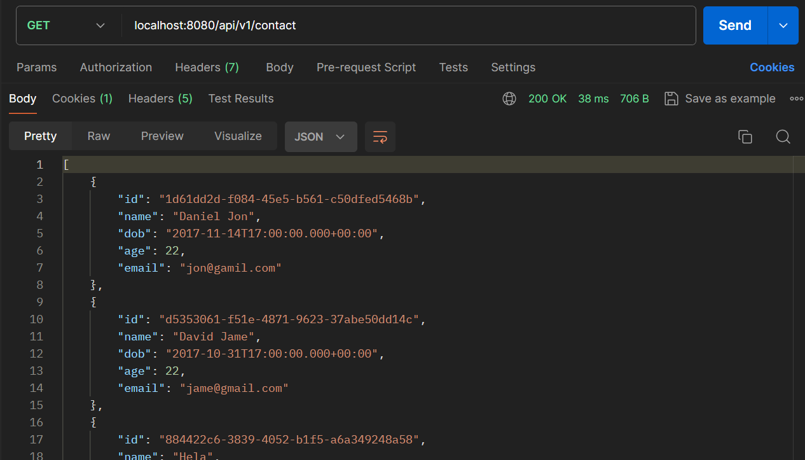
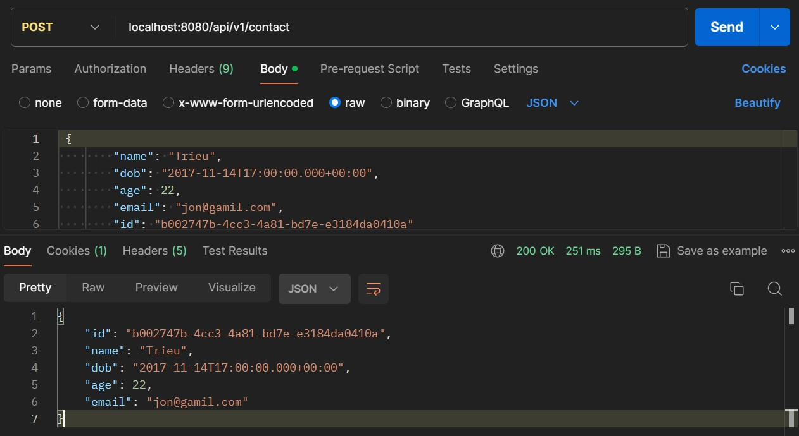
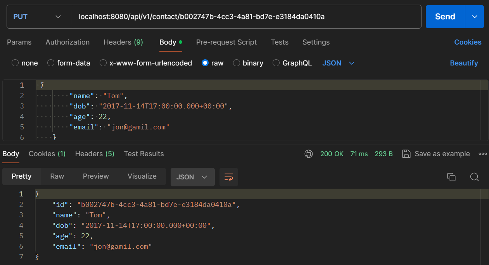
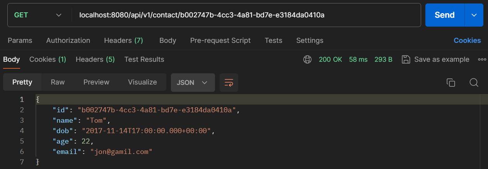

## Contact API

This Back-end provides some API for Contact database:
1. GET /api/v1/contact
This API give all contacts in the database.

2. POST /api/v1/contact/{id}
This API will save new contact.

3. PUT /api/v1/contact/{id}
This API update already exist data.

4. GET /api/v1/contacts/{id}
This API give contact that have the requested id.
