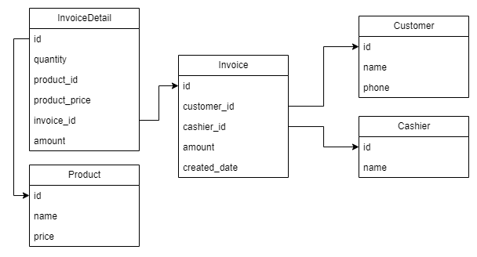

## Assignment 02: Invoices management application
The database schema


The initialization sql script is in the `init.sql`.

#### Customer table
```sql
CREATE TABLE Customer (
    id INT PRIMARY KEY,
    name VARCHAR(100) NOT NULL,
    phone VARCHAR(15)
);
```
- id: A unique identifier for each customer.
- name: The name of the customer.
- phone: The phone number of the customer.

#### Cashier table
```sql
CREATE TABLE Cashier (
    id INT PRIMARY KEY,
    name VARCHAR(100) NOT NULL
);
```
- id: A unique identifier for each cashier.
- name: The name of the cashier.

#### Invoice table
```sql
CREATE TABLE Invoice (
    id INT PRIMARY KEY,
    customer_id INT,
    cashier_id INT,
    amount DECIMAL(10, 2),
    created_date TIMESTAMP,
    FOREIGN KEY (customer_id) REFERENCES Customer(id),
    FOREIGN KEY (cashier_id) REFERENCES Cashier(id)
);
```
- id: A unique identifier for each invoice.
- customer_id: A reference to the customer associated with the invoice.
- cashier_id: A reference to the cashier who processed the invoice.
- amount: The total amount of the invoice.
- created_date: The date and time when the invoice was created.
- FOREIGN KEY (customer_id): Ensures the customer ID exists in the Customer table.
- FOREIGN KEY (cashier_id): Ensures the cashier ID exists in the Cashier table.

#### Product table
```sql
CREATE TABLE Product (
    id INT PRIMARY KEY,
    name VARCHAR(100) NOT NULL,
    price DECIMAL(10, 2)
);
```
- id: A unique identifier for each product.
- name: The name of the product.
- price: The price of the product.

#### InvoiceDetail
```sql
CREATE TABLE InvoiceDetail (
    id INT PRIMARY KEY,
    quantity INT NOT NULL,
    product_id INT,
    product_price DECIMAL(10, 2),
    invoice_id INT,
    amount DECIMAL(10, 2),
    FOREIGN KEY (product_id) REFERENCES Product(id),
    FOREIGN KEY (invoice_id) REFERENCES Invoice(id)
);
```
- id: A unique identifier for each invoice detail entry.
- quantity: The quantity of the product purchased.
- product_id: A reference to the product associated with this detail.
- product_price: The price of the product at the time of purchase.
- invoice_id: A reference to the invoice associated with this detail.
- amount: The total amount for this invoice detail entry.
- FOREIGN KEY (product_id): Ensures the product ID exists in the Product table.
- FOREIGN KEY (invoice_id): Ensures the invoice ID exists in the Invoice table.