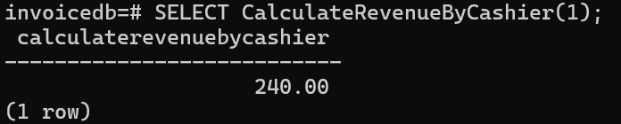
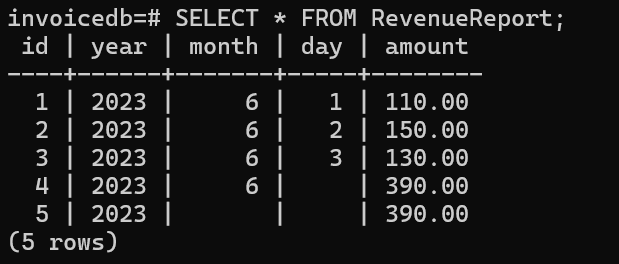

## Assignment 03: Create view, function and procedure
#### 1. View to show list products customer bought
```sql
CREATE VIEW CustomerProductView AS
SELECT 
    c.id AS customer_id,
    c.name AS customer_name,
    p.id AS product_id,
    p.name AS product_name,
    id.quantity,
    id.amount,
    i.created_date
FROM 
    Customer c
JOIN 
    Invoice i ON c.id = i.customer_id
JOIN 
    InvoiceDetail id ON i.id = id.invoice_id
JOIN 
    Product p ON id.product_id = p.id;
```
- View Definition: This SQL command creates a view called CustomerProductView.
- SELECT Clause: Selects the necessary columns to show a comprehensive view of what products each customer has bought.
- FROM Clause: Specifies the main table and the joins:
    - Customer c: The main table (aliased as c).
    - JOIN Invoice i ON c.id = i.customer_id: Joins the Invoice table based on the customer ID.
    - JOIN InvoiceDetail id ON i.id = id.invoice_id: Joins the InvoiceDetail table based on the invoice ID.
    - JOIN Product p ON id.product_id = p.id: Joins the Product table based on the product ID.
The view can be seen from:
```sql
SELECT * FROM CustomerProductView;
```

#### 2. Function calculating revenue by cashier
```sql
CREATE FUNCTION CalculateRevenueByCashier(cashier_id_param INT)
RETURNS DECIMAL(10, 2) AS $$
DECLARE 
    revenue DECIMAL(10, 2);
BEGIN
    SELECT COALESCE(SUM(amount), 0) INTO revenue
    FROM Invoice
    WHERE cashier_id = cashier_id_param;

    RETURN revenue;
END;
$$ LANGUAGE plpgsql;
```
- Function Definition: This SQL command creates a function named CalculateRevenueByCashier.
- Parameter: The function takes one parameter, cashier_id_param, which is the ID of the cashier.
- Return Type: The function returns a decimal value with two decimal places.
- DECLARE: Declares a local variable revenue to store the calculated revenue.
- BEGIN...END: Marks the beginning and end of the function body.
    - SELECT COALESCE(SUM(amount), 0) INTO revenue FROM Invoice WHERE cashier_id = cashier_id_param;:
        - Calculates the sum of amount from the Invoice table where the cashier_id matches cashier_id_param.
        - COALESCE ensures that if no matching records are found, 0 is returned instead of NULL.
    - RETURN revenue;: Returns the calculated revenue.

The function can be used like:
```sql
SELECT CalculateRevenueByCashier(1);
```


#### 3. Table revenue_report and procedures

##### Revenue report table
```sql
CREATE TABLE RevenueReport (
    id SERIAL PRIMARY KEY,
    year INT,
    month INT,
    day INT,
    amount DECIMAL(10, 2)
);
```
- Table Definition: Creates a table named RevenueReport.

##### Revenue procedures
```sql
-- Daily Revenue
CREATE OR REPLACE PROCEDURE CalculateDailyRevenue(IN report_day DATE)
LANGUAGE plpgsql
AS $$
DECLARE
    daily_revenue DECIMAL(10, 2);
BEGIN
    SELECT COALESCE(SUM(amount), 0) INTO daily_revenue
    FROM Invoice
    WHERE DATE(created_date) = report_day;

    INSERT INTO RevenueReport (year, month, day, amount)
    VALUES (EXTRACT(YEAR FROM report_day), EXTRACT(MONTH FROM report_day), EXTRACT(DAY FROM report_day), daily_revenue);
END;
$$;

-- Monthly Revenue
CREATE OR REPLACE PROCEDURE CalculateMonthlyRevenue(IN report_month INT, IN report_year INT)
LANGUAGE plpgsql
AS $$
DECLARE
    monthly_revenue DECIMAL(10, 2);
BEGIN
    SELECT COALESCE(SUM(amount), 0) INTO monthly_revenue
    FROM Invoice
    WHERE EXTRACT(MONTH FROM created_date) = report_month AND EXTRACT(YEAR FROM created_date) = report_year;

    INSERT INTO RevenueReport (year, month, day, amount)
    VALUES (report_year, report_month, NULL, monthly_revenue);
END;
$$;

-- Yearly Revenue
CREATE OR REPLACE PROCEDURE CalculateYearlyRevenue(IN report_year INT)
LANGUAGE plpgsql
AS $$
DECLARE
    yearly_revenue DECIMAL(10, 2);
BEGIN
    SELECT COALESCE(SUM(amount), 0) INTO yearly_revenue
    FROM Invoice
    WHERE EXTRACT(YEAR FROM created_date) = report_year;

    INSERT INTO RevenueReport (year, month, day, amount)
    VALUES (report_year, NULL, NULL, yearly_revenue);
END;
$$;
```
- Procedure Definition: Creates or replaces a procedure named CalculateDailyRevenue.
- Parameter: Takes one input parameter, report_day, which is the date for which the daily revenue is calculated.
- DECLARE: Declares a local variable daily_revenue to store the calculated daily revenue.
- BEGIN...END: Marks the beginning and end of the procedure body.
    - SELECT COALESCE(SUM(amount), 0) INTO daily_revenue FROM Invoice WHERE DATE(created_date) = report_day;:
        - Calculates the sum of amount for invoices created on report_day.
    - INSERT INTO RevenueReport (year, month, day, amount) VALUES ... :
        - Inserts the calculated daily/monthly/yearly revenue into the RevenueReport table.

Execute the procedures to populate the RevenueReport table:
```sql
CALL CalculateDailyRevenue('2023-06-01');
CALL CalculateDailyRevenue('2023-06-02');
CALL CalculateDailyRevenue('2023-06-03');
CALL CalculateMonthlyRevenue(6, 2023);
CALL CalculateYearlyRevenue(2023);
```

The result can be seen from:
```sql
SELECT * FROM RevenueReport;
```
