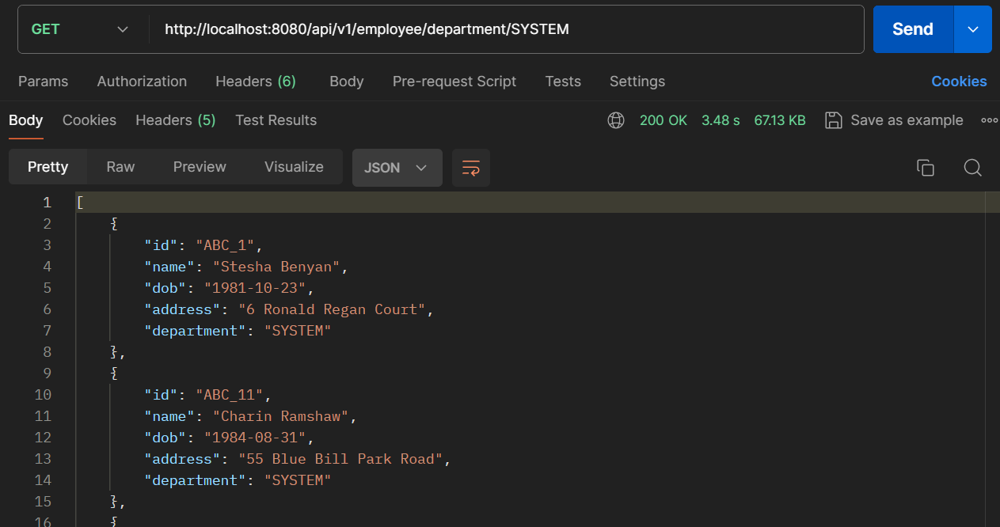
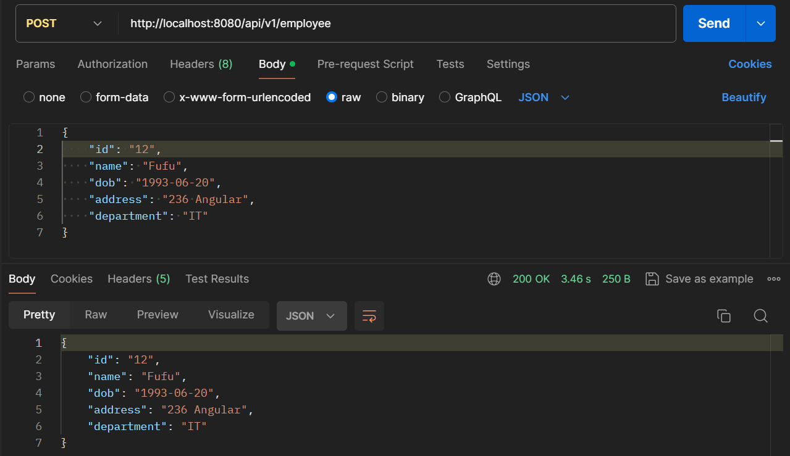
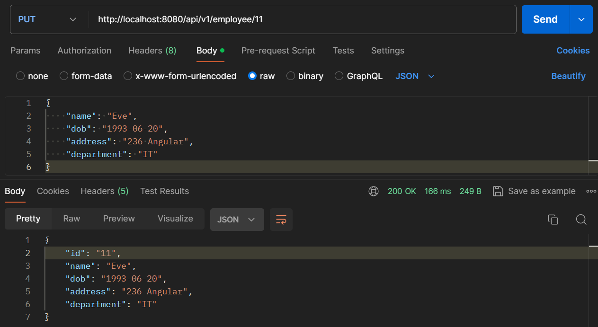
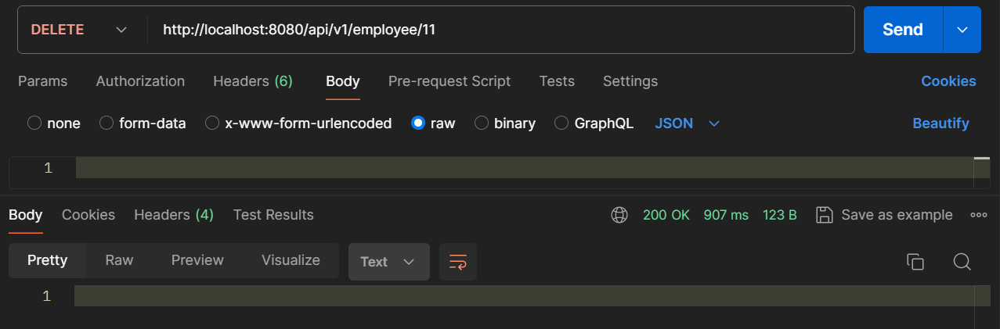

## Employee CRUD

#### Overview
The Employee CRUD API provides a set of endpoints to create, read, update, and delete employee records. Additionally, it supports  uploads of employee data via CSV files. This project demonstrates a CRUD (Create, Read, Update, Delete) application using Spring Boot and PostgreSQL.

#### Prerequisites
1. Java Development Kit (JDK)
2. Apache Maven
3. PostgreSQL

#### Services
This Back-end provides some API for Employee database:
1. GET /api/v1/employee
This API give all employees in the database.


2. GET /api/v1/employee/{id}
This API give employee that have the requested id.


3. GET /api/v1/employee/department/{department}
This API give employees that have the requested id.


4. POST /api/v1/employee
This API will save new employee to database.


5. POST /api/v1/employee/upload-csv
This API will save new employee to database from csv.


6. PUT /api/v1/employee/{id}
This API update already exist data that have the requested id.


4. DELETE /api/v1/employee/{id}
This API


#### Running the Application
1. Ensure you have Java, Maven and PostgreSQL installed on your system.
2. Create database lecture5employeecrud in PostgreSQL.
3. Build the project
```cmd
mvn clean install
```
4. Run the application
```cmd
mvn spring-boot:run
```
5. The API will run in localhost:8080