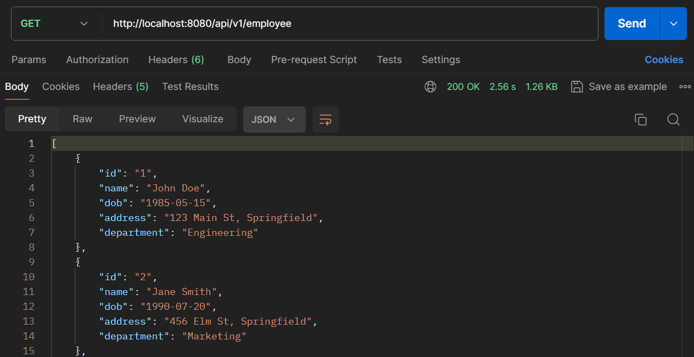

## Employee CRUD

#### Overview
The Employee CRUD API provides a set of endpoints to create, read, update, and delete employee records. Additionally, it supports  uploads of employee data via CSV files. This project demonstrates a CRUD (Create, Read, Update, Delete) application using Spring Boot and PostgreSQL.

#### Prerequisites
1. Java Development Kit (JDK)
2. Apache Maven
3. PostgreSQL

#### Init Database
Init 2 database with name lecture8employeecrud and lecture8employeecrud2. The second database table need to be initialized too but keep the data empty.
```sql
-- Create the employees table
CREATE TABLE employees (
    id VARCHAR(50) PRIMARY KEY,
    name VARCHAR(100) NOT NULL,
    dob DATE NOT NULL,
    address VARCHAR(255) NOT NULL,
    department VARCHAR(100) NOT NULL
);

-- Insert some initial data
INSERT INTO employees (id, name, dob, address, department) VALUES
('1', 'John Doe', '1980-01-01', '123 Elm Street', 'Engineering'),
('2', 'Jane Smith', '1990-02-02', '456 Oak Avenue', 'Marketing'),
('3', 'Emily Johnson', '1985-03-03', '789 Pine Road', 'Sales'),
('4', 'Michael Brown', '1975-04-04', '101 Maple Blvd', 'Engineering'),
('5', 'Sarah Davis', '1995-05-05', '202 Birch Lane', 'Human Resources');
```

#### Services
This Back-end provides some API for Employee database:
1. GET /api/v1/employee
This API give all employees in the database.


2. GET /api/v1/employee/{id}
This API give employee that have the requested id.


3. GET /api/v1/employee/department/{department}
This API give employees that have the requested id.


4. POST /api/v1/employee
This API will save new employee to database.


5. POST /api/v1/employee/upload-csv
This API will save new employee to database from csv.


6. PUT /api/v1/employee/{id}
This API update already exist data that have the requested id.


4. DELETE /api/v1/employee/{id}
This API delete employee with id


5. POST /api/v1/employee/transfer-engineering-employees
This API transfer engineering employee to another database


6. POST /api/v1/employee/failed-transfer-engineering-employees
   This API failed to transfer engineering employee to another database


#### Running the Application
1. Ensure you have Java, Maven and PostgreSQL installed on your system.
2. Create database lecture5employeecrud in PostgreSQL.
3. Build the project
```cmd
mvn clean install
```
4. Run the application
```cmd
mvn spring-boot:run
```
5. The API will run in localhost:8080

#### Testing the Transaction
##### Using success API
Before transfer:


After transfer:


##### Using failed API
Before transfer:


After transfer:

