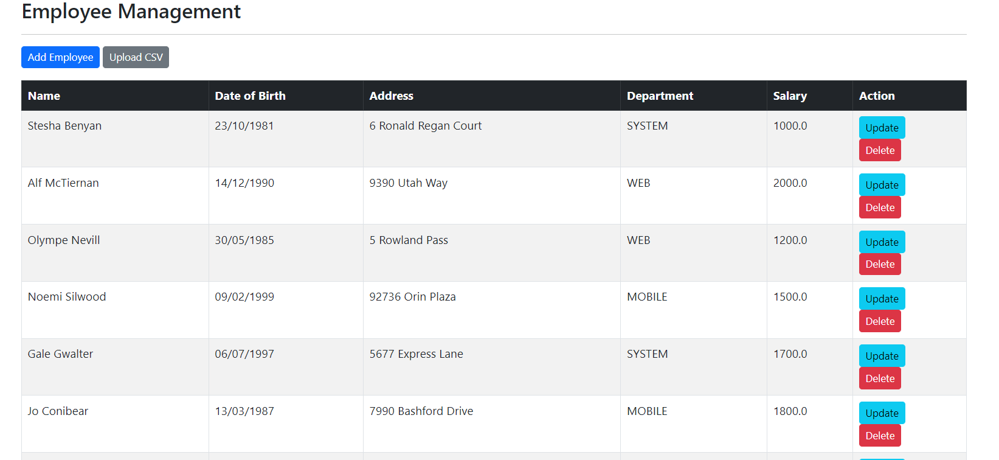
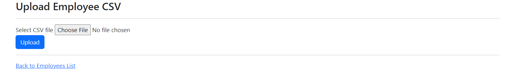
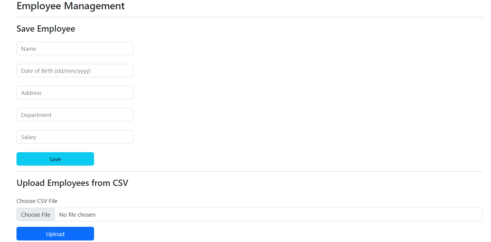

## Assignment 02: Employee Management Web

### Overview
This repository contains a web application for managing employee records. It is built using Spring Boot framework with Thymeleaf for server-side HTML rendering and PostgreSQL as the database.

### Technologies used
- Spring Boot: Framework for building the application.
- Thymeleaf: Server-side Java template engine for rendering HTML.
- PostgreSQL: Database management system used for storing employee data.
- Bootstrap: Front-end framework for responsive web design.

### Features
- List Employees: View a list of all employees with options to update or delete each record.
- Add Employee: Add a new employee to the database.
- Update Employee: Update existing employee details.
- Delete Employee: Remove an employee from the database.
- Upload CSV: Import employees from a CSV file into the database.

### Folder structure
```cmd
└───main
    ├───java
    │   └───com
    │       └───week5
    │           └───Assignment02
    │               │   Assignment02Application.java
    │               │
    │               ├───controller
    │               │       EmployeeController.java
    │               │
    │               ├───model
    │               │       Employee.java
    │               │
    │               ├───repository
    │               │       EmployeeRepository.java
    │               │
    │               └───service
    │                   │   EmployeeService.java
    │                   │
    │                   └───impl
    │                           EmployeeServiceImpl.java
    │
    └───resources
        │   application.properties
        │
        ├───static
        │       index.html
        │
        └───templates
            └───employees
                    employee-form.html
                    list-employees.html
                    upload-form.html
```

### How to run
1. Create PostgreSQL database named lecture9_2, configure the username and password in the `application.properties`
```sql
CREATE TABLE employee (
    id SERIAL PRIMARY KEY,
    first_name VARCHAR(45),
    last_name VARCHAR(45),
    email VARCHAR(45)
);

INSERT INTO employee (id, first_name, last_name, email) VALUES
    (1, 'Leslie', 'Andrews', 'leslie@luv2code.com'),
    (2, 'Emma', 'Baumgarten', 'emma@luv2code.com'),
    (3, 'Avani', 'Gupta', 'avani@luv2code.com'),
    (4, 'Yuri', 'Petrov', 'yuri@luv2code.com'),
    (5, 'Juan', 'Vega', 'juan@luv2code.com');
```
2. Execute `mvn spring-boot:run` in the project directory
3. The application will be accessible at `http://localhost:8080`


### The webview




