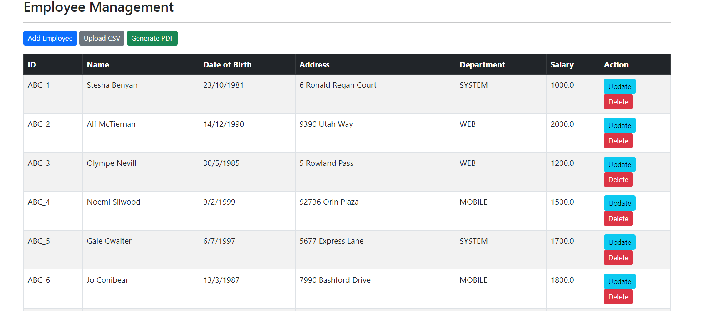
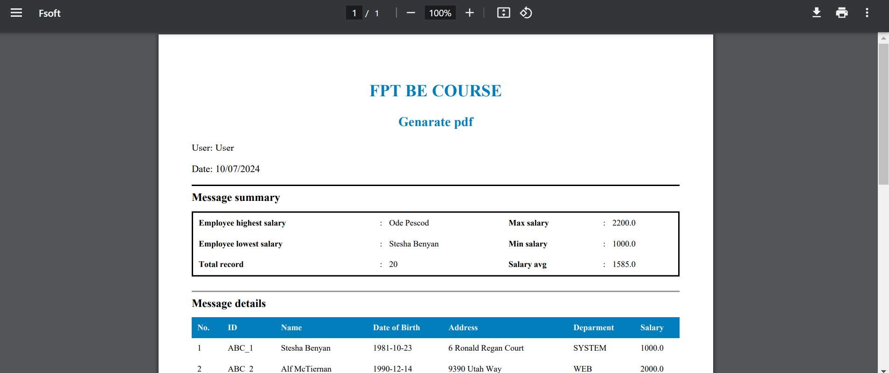

## Assignment 03: Employee Management PDF Generator

### Overview
This repository contains a Spring Boot application for generating PDF reports of employee information. The application utilizes Thymeleaf for HTML template rendering and iText PDF library for converting HTML to PDF format. PostgreSQL is used as the database management system to store employee data.

### Technologies used
- Spring Boot: Framework for building the application.
- Thymeleaf: Server-side Java template engine for rendering HTML.
- iText PDF: Library for creating and manipulating PDF documents.
- PostgreSQL: Database management system used for storing employee data.

### Features
- Generate Employee Info PDF: Creates a comprehensive PDF report summarizing employee data including highest and lowest salaries, average salary, total records, and employee details.
- Upload CSV: Import employees from a CSV file into the database.

### Folder structure
```cmd
└───main
    ├───java
    │   └───com
    │       └───week5
    │           └───Assignment02
    │               │   Assignment02Application.java
    │               │
    │               ├───controller
    │               │       EmployeeController.java
    │               │
    │               ├───model
    │               │       Employee.java
    │               │
    │               ├───repository
    │               │       EmployeeRepository.java
    │               │
    │               └───service
    │                   │   EmployeeService.java
    │                   │   PdfService.java
    │                   │
    │                   └───impl
    │                           EmployeeServiceImpl.java
    │
    └───resources
        │   application.properties
        │
        ├───static
        │       index.html
        │
        └───templates
            └───employees
                    employee-form.html
                    list-employees.html
                    upload-form.html
```

### How to run
1. Create PostgreSQL database named lecture9_2, configure the username and password in the `application.properties`
2. Execute `mvn spring-boot:run` in the project directory
3. The application will be accessible at `http://localhost:8080`


### The webview


