## Assignment 01: Employee Management System

### Overview
This project is a simple web application built using Spring Boot for managing employee records. It provides basic CRUD functionalities (Create, Read, Update, Delete) for employees stored in a PostgreSQL database.

### Technologies Used
- Spring Boot: Framework for creating and running Spring-based applications.
- PostgreSQL: Open-source relational database management system.

### Features
- List Employees: View a list of all employees with options to update or delete each record.
- Add Employee: Add a new employee to the database.
- Update Employee: Modify existing employee details.
- Delete Employee: Remove an employee from the database.

### Project Structure
```cmd
└───main
    ├───java
    │   └───com
    │       └───lecture10
    │           └───Assignment01
    │               │   EmployeeCrudApplication.java
    │               │
    │               ├───controllers
    │               │       EmployeeController.java
    │               │
    │               ├───data
    │               │   ├───models
    │               │   │       Employee.java
    │               │   │
    │               │   └───repository
    │               │           EmployeeRepository.java
    │               │
    │               ├───dto
    │               │       EmployeeDTO.java
    │               │
    │               ├───exception
    │               │       BusinessException.java
    │               │       GlobalExceptionHandler.java
    │               │       ResourceNotFoundException.java
    │               │       ValidationException.java
    │               │
    │               ├───mapper
    │               │       EmployeeMapper.java
    │               │
    │               ├───service
    │               │   │   EmployeeService.java
    │               │   │
    │               │   └───impl
    │               │           EmployeeServiceImpl.java
    │               │
    │               └───util
    │                       DateUtil.java
    │
    └───resources
            application.properties
```

### Running the Application
1. Create PostgreSQL database named lecture10_1, configure the username and password in the `application.properties`
2. Execute `mvn spring-boot:run` in the project directory
3. The application will be accessible at `http://localhost:8080`

### API List
1. List all Employees
   Endpoint: /api/employees
   Method: GET
   Description: Retrieves a list of all employees stored in the database.
   Response: JSON array containing employee details including id, name, dateOfBirth, address, department, email, and phone.
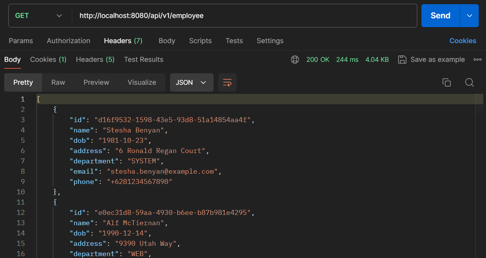
2. Get Employee by ID
   Endpoint: /api/employees/{id}
   Method: GET
   Description: Retrieves details of a specific employee based on the id path parameter.
   Response: JSON object containing employee details for the specified id.
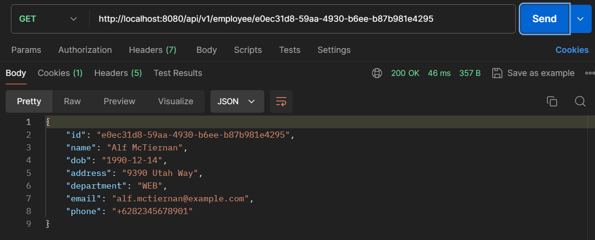
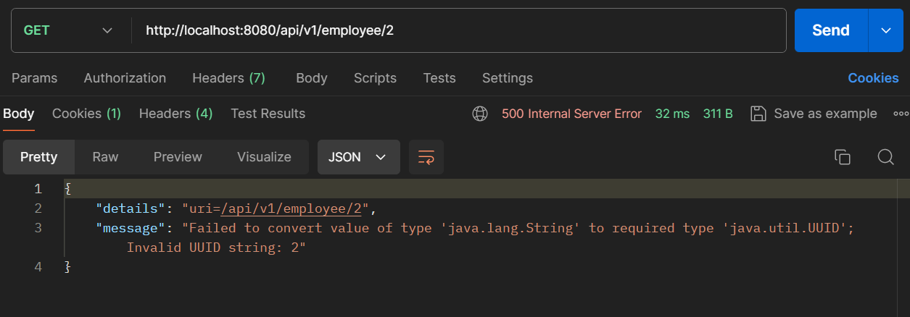
3. Add Employee
   Endpoint: /api/employees
   Method: POST
   Description: Adds a new employee to the database.
   Request Body: JSON object containing name, dateOfBirth, address, department, email, and phone of the new employee.
   Response: JSON object confirming the addition of the new employee with assigned id.
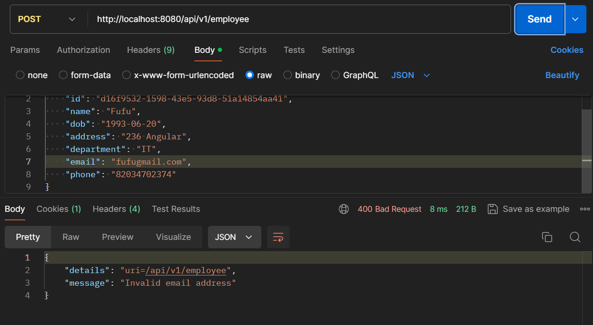
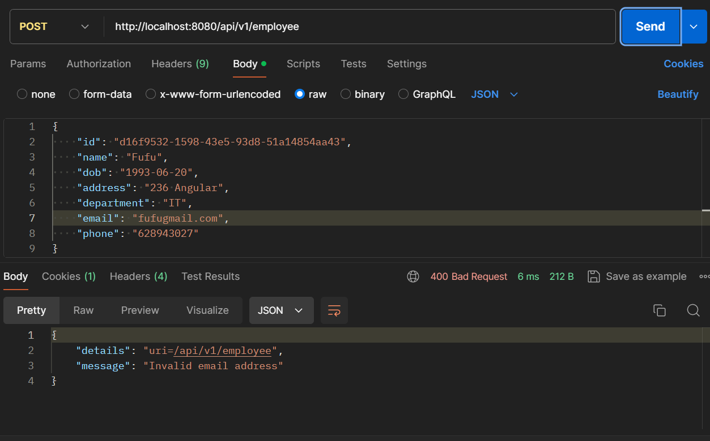

4. Update Employee
   Endpoint: /api/employees/{id}
   Method: PUT
   Description: Updates details of an existing employee identified by the id path parameter.
   Request Body: JSON object containing updated name, dateOfBirth, address, department, email, and phone fields.
   Response: JSON object confirming the successful update of employee details.
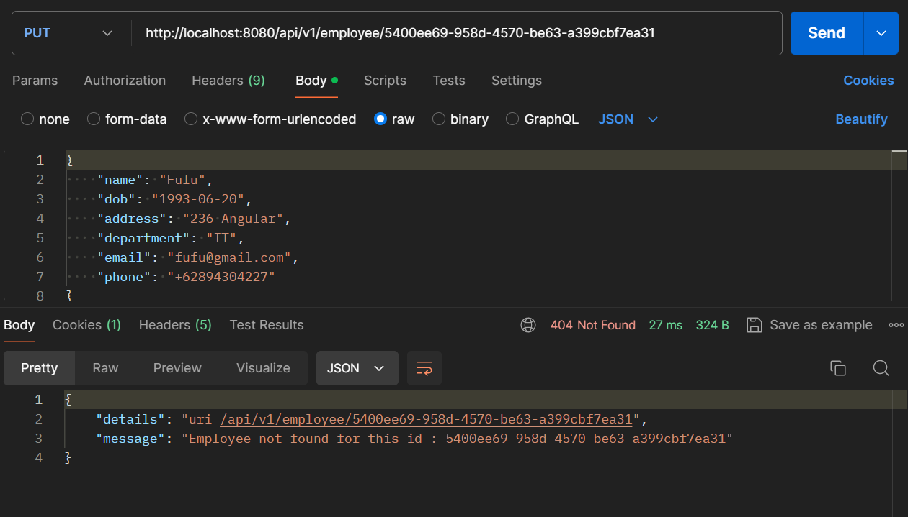
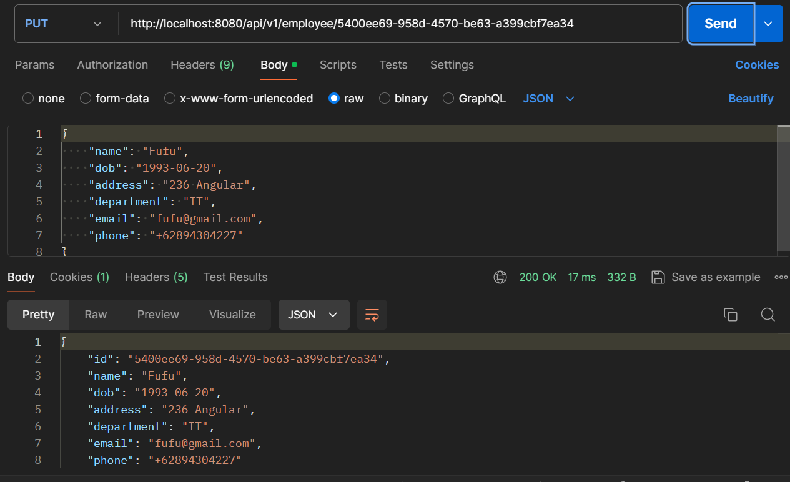
5. Delete Employee
   Endpoint: /api/employees/{id}
   Method: DELETE
   Description: Deletes an employee from the database based on the id path parameter.
   Response: JSON object confirming the deletion of the employee.
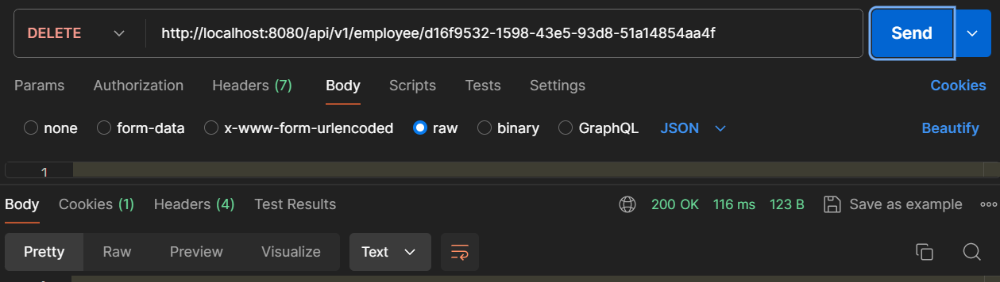
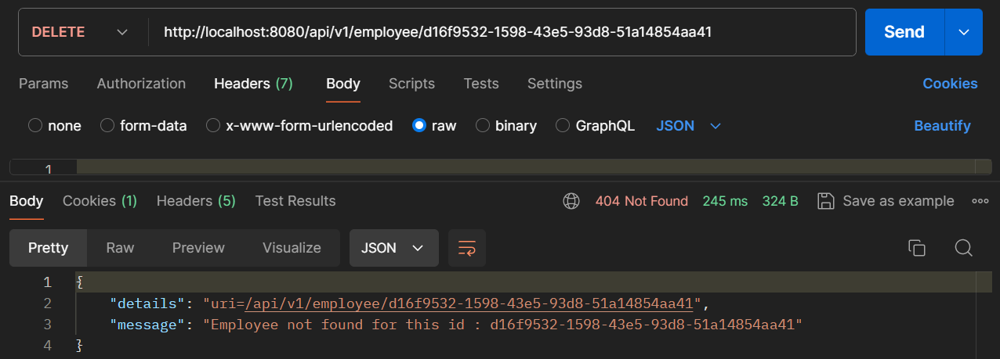
6. Upload CSV File
   Endpoint: /api/upload-csv
   Method: POST
   Description: Accepts a CSV file containing employee data, parses it, and saves the employees to the database.
   Request Body: Form-data with file parameter containing the CSV file.
   Response: JSON object indicating the success or failure of the file upload process.
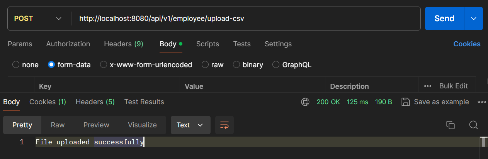
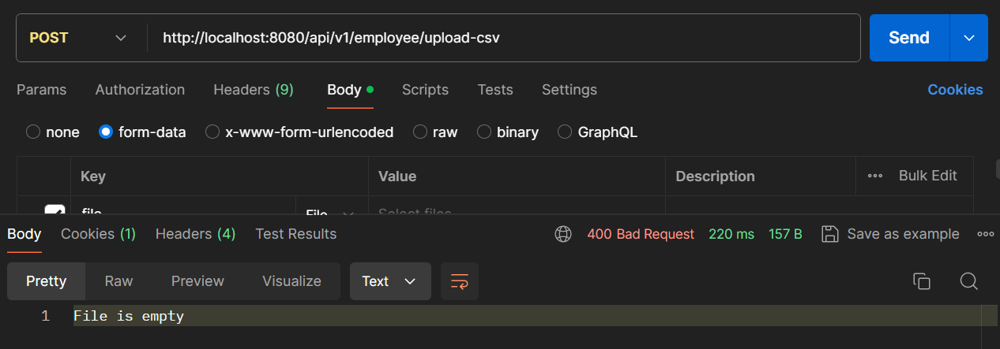