## Assignment 01: Spring MVC Simple Demo

### Overview
This repository contains a REST API for managing employee records, departments, and salaries. It is built using the Spring Boot framework with RESTful services and a relational database.

### Technologies used
- Spring Boot: Framework for building the application.
- Spring Data JPA: For database access and ORM.
- PostgreSQL/MySQL: Database management system used for storing employee data.
- Spring Web: For building REST API services.

### Features
- Manage Employees: View a paginated list of all employees, add new employees, update existing employee details, and delete employees.
- Manage Departments: View a list of all departments, add new departments, update department details, and delete departments.
- Manage Salaries: Add or update employee salaries.
- Manage Titles: Add or update employee titles.

### Composite Key with JPA
In this application, composite keys are used in entities such as DeptEmp, DeptManager, Salary, and Title. Below is an example of how composite keys are implemented using @IdClass in DeptEmp and DeptManager entities.

Example: DeptEmpId Composite Key
```java
package com.week6.Assignment01.model;

import lombok.Getter;
import lombok.Setter;

import java.io.Serializable;

@Getter
@Setter
public class DeptEmpId implements Serializable {
    private int empNo;
    private String deptNo;

    public DeptEmpId() {
    }

    public DeptEmpId(int empNo, String deptNo){
        this.empNo = empNo;
        this.deptNo = deptNo;
    }
}

```
- Composite Key (DeptEmpId): Declared as a separate class (DeptEmpId) implementing Serializable, encapsulating empNo and deptNo fields.

Example: DeptEmp Entity
```java
package com.week6.Assignment01.model;

import jakarta.persistence.*;
import lombok.Getter;
import lombok.Setter;

import java.util.Date;

@Entity
@Getter
@Setter
@Table(name = "dept_emp")
@IdClass(DeptEmpId.class)
public class DeptEmp {
    @Id
    @Column(name = "emp_no")
    private int empNo;

    @Id
    @Column(name = "dept_no", length = 4)
    private String deptNo;

    @Temporal(TemporalType.DATE)
    @Column(name = "from_date")
    private Date fromDate;

    @Temporal(TemporalType.DATE)
    @Column(name = "to_date")
    private Date toDate;

    @ManyToOne
    @JoinColumn(name = "emp_no", insertable = false, updatable = false)
    private Employee employee;

    @ManyToOne
    @JoinColumn(name = "dept_no", insertable = false, updatable = false)
    private Department department;
}
```
- Uses @Id annotations on empNo and deptNo to denote them as composite primary key fields.
- Utilizes @IdClass(DeptEmpId.class) to specify DeptEmpId as the composite key class.
- Defines @ManyToOne associations with Employee and Department, employing @JoinColumn to indicate the foreign key columns.


### Folder structure
```cmd
├───java
│   └───com
│       └───week6
│           └───Assignment01
│               │   Assignment01Application.java
│               │
│               ├───controller
│               │       DepartmentController.java
│               │       EmployeeController.java
│               │       SalaryController.java
│               │       TitleController.java
│               │
│               ├───model
│               │       Department.java
│               │       DeptEmp.java
│               │       DeptEmpId.java
│               │       DeptManager.java
│               │       DeptManagerId.java
│               │       Employee.java
│               │       Salary.java
│               │       SalaryId.java
│               │       Title.java
│               │       TitleId.java
│               │
│               ├───repository
│               │       DepartmentRepository.java
│               │       EmployeeRepository.java
│               │       SalaryRepository.java
│               │       TitleRepository.java
│               │
│               └───service
│                       DepartmentService.java
│                       EmployeeService.java
│                       SalaryService.java
│                       TitleService.java
│
└───resources
    │   application.properties
    │
    ├───static
    └───templates
```

### How to run
1. Create PostgreSQL database named lecture11_1
2. Execute `mvn spring-boot:run` in the project directory
3. The application will be accessible at `http://localhost:8080`

### Screenshots


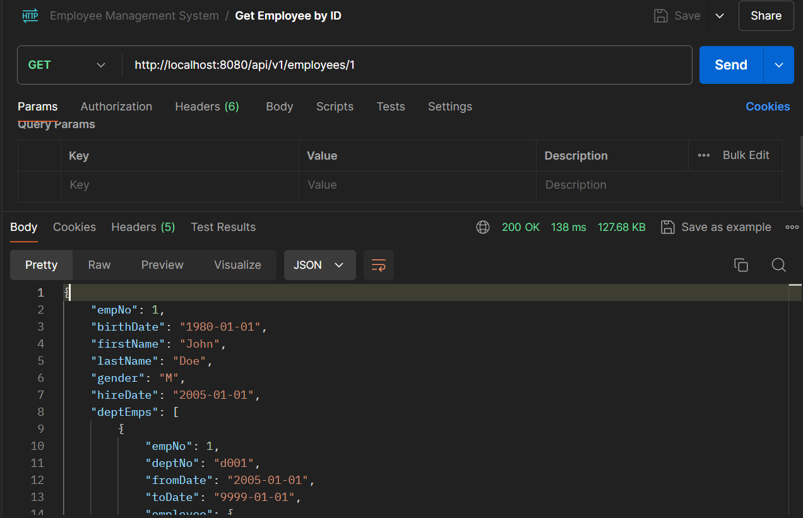

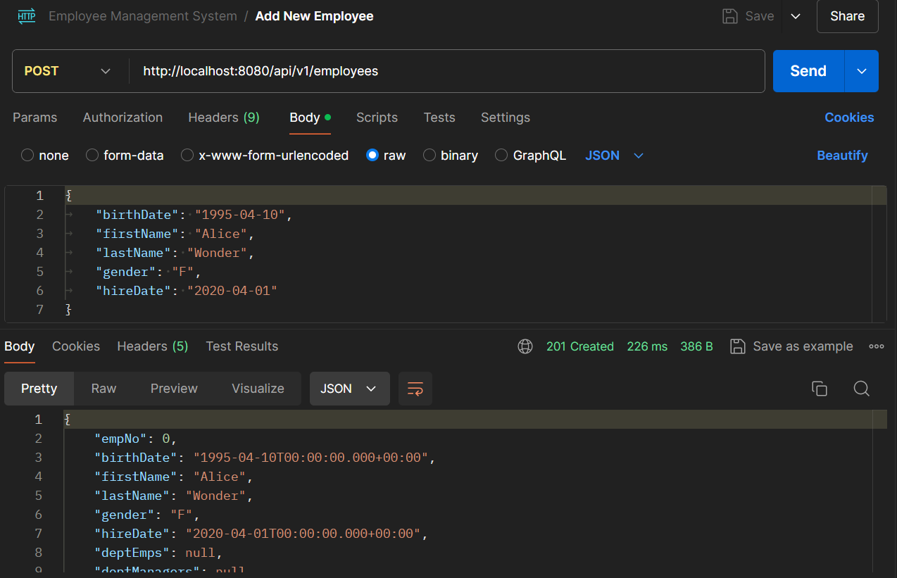

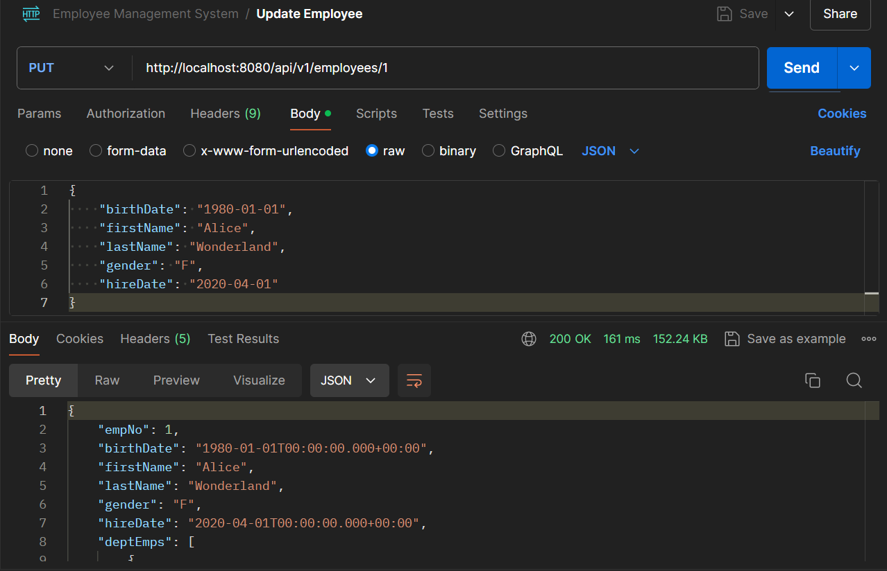

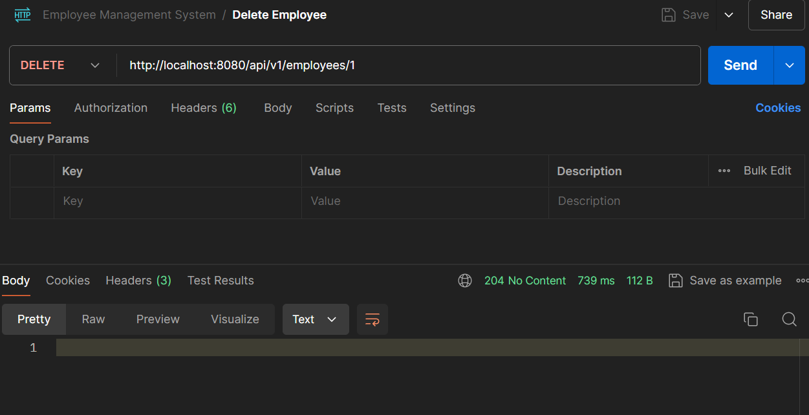

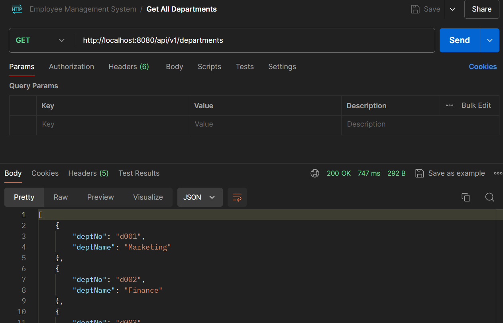

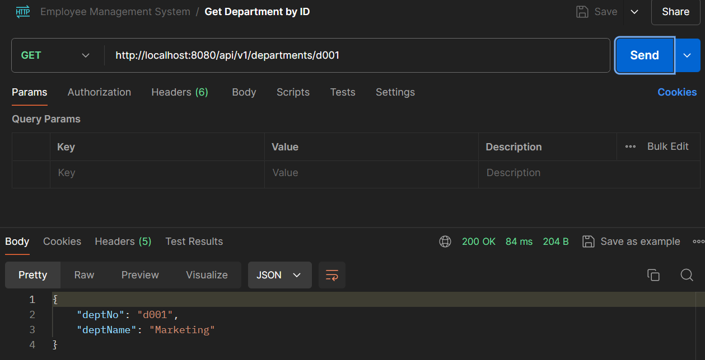

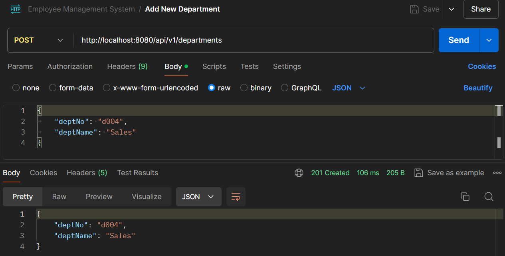

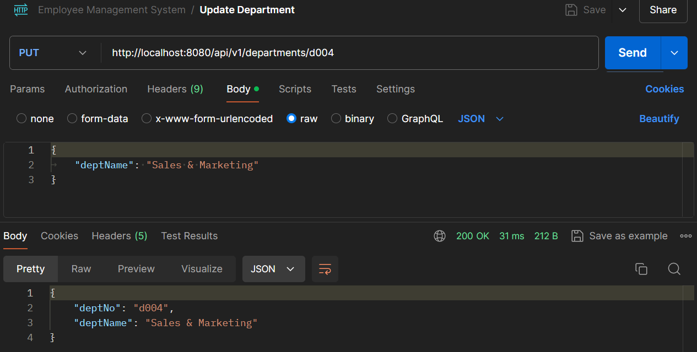

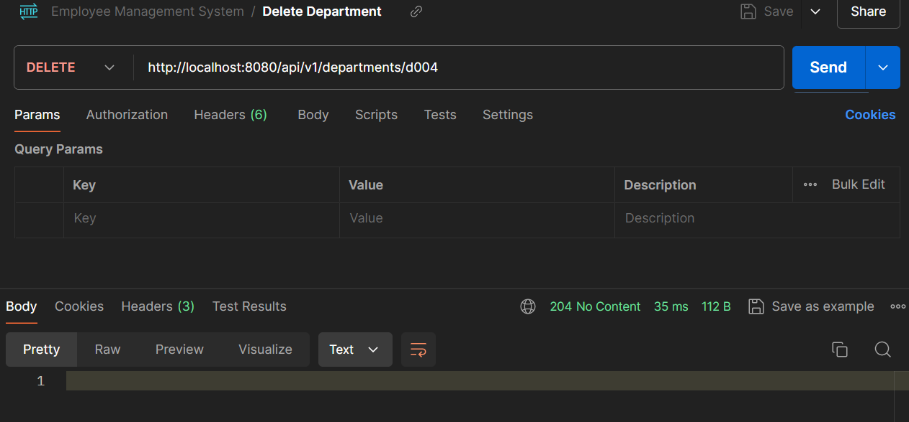

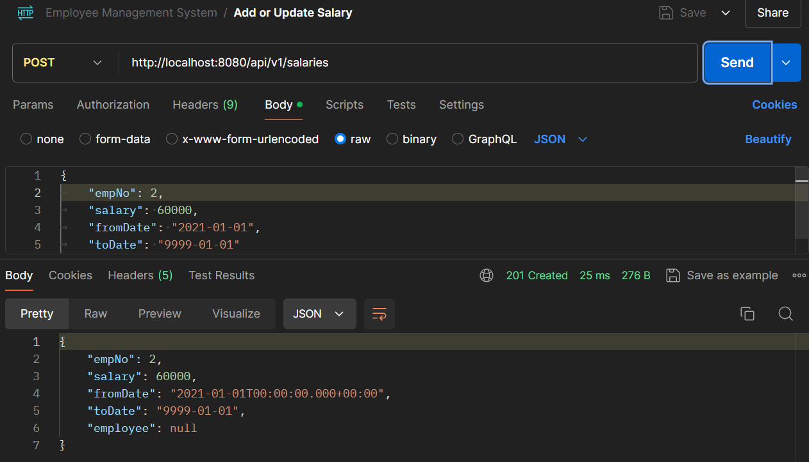

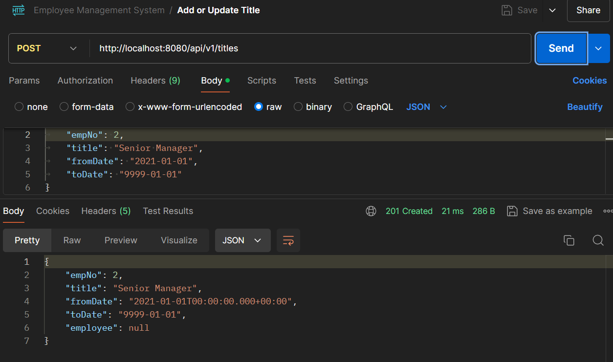