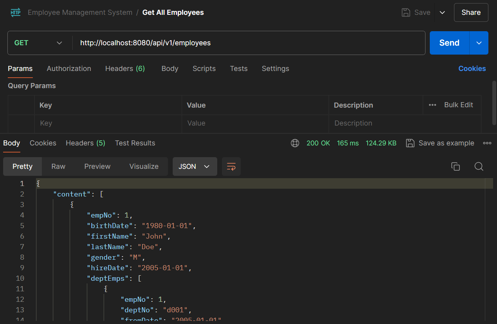
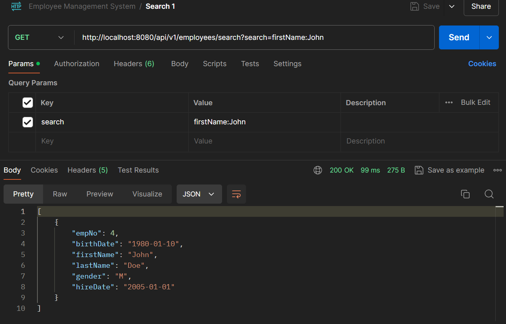
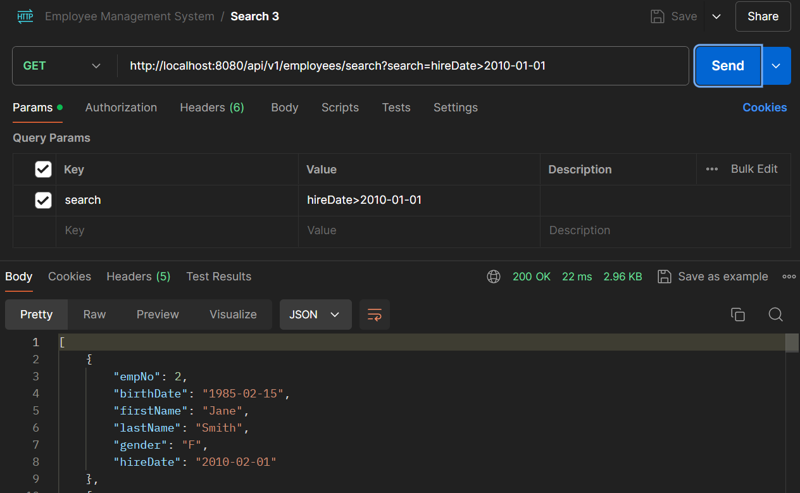
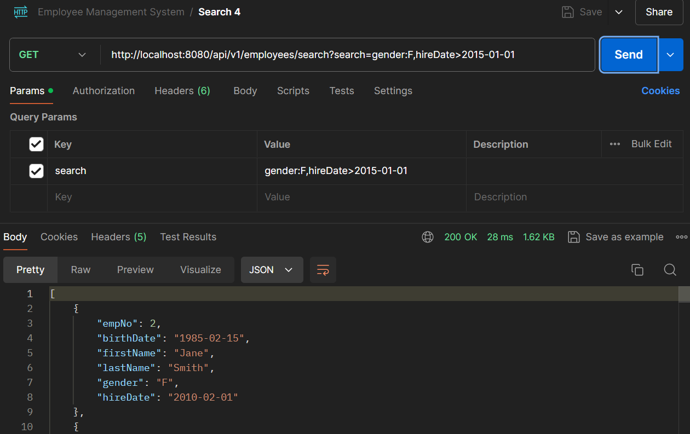

## Assignment 01: Spring Data JPA Employee Management

### Overview
This repository contains a REST API for managing employee records, departments, and salaries. It is built using the Spring Boot framework with RESTful services and a relational database.

### Technologies used
- Spring Boot: Framework for building the application.
- Spring Data JPA: For database access and ORM.
- PostgreSQL/MySQL: Database management system used for storing employee data.
- Spring Web: For building REST API services.

### Features
- Manage Employees: View a paginated list of all employees, add new employees, update existing employee details, and delete employees.
- Manage Departments: View a list of all departments, add new departments, update department details, and delete departments.
- Manage Salaries: Add or update employee salaries.
- Manage Titles: Add or update employee titles.
- Dynamic Querying: Allows for flexible and dynamic searching of employee records based on various criteria.

### Composite Key with JPA
In this application, composite keys are used in entities such as DeptEmp, DeptManager, Salary, and Title. Below is an example of how composite keys are implemented using @IdClass in DeptEmp and DeptManager entities.

Example: DeptEmpId Composite Key
```java
@Getter
@Setter
public class DeptEmpId implements Serializable {
    private int empNo;
    private String deptNo;

    public DeptEmpId() {
    }

    public DeptEmpId(int empNo, String deptNo){
        this.empNo = empNo;
        this.deptNo = deptNo;
    }
}

```
- Composite Key (DeptEmpId): Declared as a separate class (DeptEmpId) implementing Serializable, encapsulating empNo and deptNo fields.

Example: DeptEmp Entity
```java
@Entity
@Getter
@Setter
@Table(name = "dept_emp")
@IdClass(DeptEmpId.class)
public class DeptEmp {
    @Id
    @Column(name = "emp_no")
    private int empNo;

    @Id
    @Column(name = "dept_no", length = 4)
    private String deptNo;

    @Temporal(TemporalType.DATE)
    @Column(name = "from_date")
    private Date fromDate;

    @Temporal(TemporalType.DATE)
    @Column(name = "to_date")
    private Date toDate;

    @ManyToOne
    @JoinColumn(name = "emp_no", insertable = false, updatable = false)
    private Employee employee;

    @ManyToOne
    @JoinColumn(name = "dept_no", insertable = false, updatable = false)
    private Department department;
}
```
- Uses @Id annotations on empNo and deptNo to denote them as composite primary key fields.
- Utilizes @IdClass(DeptEmpId.class) to specify DeptEmpId as the composite key class.
- Defines @ManyToOne associations with Employee and Department, employing @JoinColumn to indicate the foreign key columns.

### Dynamic Querying with Spring Data JPA Specifications
The application supports dynamic querying using Spring Data JPA Specifications. This allows for flexible and complex search operations without needing to write custom query methods for each search requirement.
1. SearchCriteria Class
   Encapsulates the key, operation, and value for each search criterion.
```java
@Getter
@Setter
@AllArgsConstructor
public class SearchCriteria {
    private String key;
    private String operation;
    private Object value;
}
```
2. EmployeeSpecification Class
   Implements the Specification<Employee> interface to build dynamic predicates based on the search criteria.
```java
public class EmployeeSpecification implements Specification<Employee> {

    private SearchCriteria criteria;

    public EmployeeSpecification(SearchCriteria criteria) {
        this.criteria = criteria;
    }

    @Override
    public Predicate toPredicate(Root<Employee> root, CriteriaQuery<?> query, CriteriaBuilder builder) {
        if (criteria.getOperation().equalsIgnoreCase(">")) {
            return builder.greaterThanOrEqualTo(root.get(criteria.getKey()), criteria.getValue().toString());
        } else if (criteria.getOperation().equalsIgnoreCase("<")) {
            return builder.lessThanOrEqualTo(root.get(criteria.getKey()), criteria.getValue().toString());
        } else if (criteria.getOperation().equalsIgnoreCase(":")) {
            if (root.get(criteria.getKey()).getJavaType() == String.class) {
                return builder.like(root.get(criteria.getKey()), "%" + criteria.getValue() + "%");
            } else {
                return builder.equal(root.get(criteria.getKey()), criteria.getValue());
            }
        }
        return null;
    }
}
```
3. EmployeeSpecificationsBuilder Class
   Builds a list of EmployeeSpecification objects and combines them into a single Specification.
```java
public class EmployeeSpecificationsBuilder {
    private final List<SearchCriteria> params;

    public EmployeeSpecificationsBuilder() {
        params = new ArrayList<>();
    }

    public EmployeeSpecificationsBuilder with(String key, String operation, Object value) {
        params.add(new SearchCriteria(key, operation, value));
        return this;
    }

    public Specification<Employee> build() {
        if (params.isEmpty()) {
            return null;
        }

        Specification<Employee> result = new EmployeeSpecification(params.get(0));

        for (int i = 1; i < params.size(); i++) {
            result = Specification.where(result).and(new EmployeeSpecification(params.get(i)));
        }

        return result;
    }
}
```
4. EmployeeService Class
   Handles the search requests and uses the EmployeeSpecificationsBuilder to build the dynamic query.
```java
// other method...
public List<Employee> search(String search) {
        EmployeeSpecificationsBuilder builder = new EmployeeSpecificationsBuilder();
        Pattern pattern = Pattern.compile("(\\w+?)(:|<|>)(\\w+?),");
        Matcher matcher = pattern.matcher(search + ",");
        while (matcher.find()) {
            builder.with(matcher.group(1), matcher.group(2), matcher.group(3));
        }

        Specification<Employee> spec = builder.build();
        return employeeRepository.findAll(spec);
    }
```
5. EmployeeController Class
    Uses search in the service.
```java
// other method...
@GetMapping("/search")
    public List<Employee> search(@RequestParam(value = "search") String search) {
        return employeeService.search(search);
    }
```

### Folder structure
```cmd
├───java
│   └───com
│       └───week6
│           └───Assignment01
│               │   Assignment01Application.java
│               │
│               ├───controller
│               │       DepartmentController.java
│               │       EmployeeController.java
│               │       SalaryController.java
│               │       TitleController.java
│               │
│               ├───model
│               │       Department.java
│               │       DeptEmp.java
│               │       DeptEmpId.java
│               │       DeptManager.java
│               │       DeptManagerId.java
│               │       Employee.java
│               │       Salary.java
│               │       SalaryId.java
│               │       Title.java
│               │       TitleId.java
│               │
│               ├───repository
│               │       DepartmentRepository.java
│               │       EmployeeRepository.java
│               │       SalaryRepository.java
│               │       TitleRepository.java
│               │
│               └───service
│                       DepartmentService.java
│                       EmployeeService.java
│                       SalaryService.java
│                       TitleService.java
│
└───resources
    │   application.properties
    │
    ├───static
    └───templates
```

### How to run
1. Create PostgreSQL database named lecture11_1
2. Execute `mvn spring-boot:run` in the project directory
3. The application will be accessible at `http://localhost:8080`

### Screenshots









