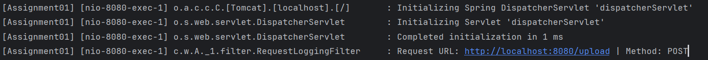

# Assignment 01: OncePerRequestFilter

### Overview
In Spring, the `OncePerRequestFilter` is a base class for filter implementations that ensures a filter is executed only once per request. It is particularly useful in web applications for tasks such as security checks, logging, or any other type of preprocessing or postprocessing that should occur once per request.

### Features of `OncePerRequestFilter`
- **Single Execution**: Ensures the filter logic runs only once per request, even in the presence of other filters.
- **Ease of Use**: Simplifies the creation of custom filters by providing a base class that handles repetitive tasks like checking if the filter has already been executed.

### Applying `OncePerRequestFilter` for Synchronous Requests
For synchronous requests, the `OncePerRequestFilter` works as intended by running the filter logic just once per request. Let's define an `AuthenticationFilter` class that extends `OncePerRequestFilter` and overrides the `doFilterInternal()` method:
```java
public class AuthenticationFilter extends OncePerRequestFilter {
    @Override
    protected void doFilterInternal(HttpServletRequest request, HttpServletResponse response, FilterChain filterChain)
            throws ServletException, IOException {
        String usrName = request.getHeader("userName");
        logger.info("Successfully authenticated user " + usrName);
        filterChain.doFilter(request, response);
    }
}
```
`OncePerRequestFilter` only supports HTTP request so we don't need to cast the request and response objects as required when directly implementing the Filter interface.

### Applying `OncePerRequestFilter` for Synchronous Requests
By default, OncePerRequestFilter does not apply to asynchronous requests. To change this, we can override `shouldNotFilterAsyncDispatch()` and `shouldNotFilterErrorDispatch()` methods.
- **`shouldNotFilterAsyncDispatch()`**: Decides if the filter should be applied to asynchronous dispatches. Returning false ensures the filter runs once per thread, even for async dispatches.
- **`shouldNotFilterErrorDispatch()`**: Decides if the filter should be applied to error dispatches.

```java
@Component
public class AuthenticationFilter extends OncePerRequestFilter {
    @Override
    protected void doFilterInternal(HttpServletRequest request, HttpServletResponse response, FilterChain filterChain)
            throws ServletException, IOException {
        String usrName = request.getHeader("userName");
        logger.info("Successfully authenticated user " + usrName);
        filterChain.doFilter(request, response);
    }

    @Override
    protected boolean shouldNotFilterAsyncDispatch() {
        return false;
    }

    @Override
    protected boolean shouldNotFilterErrorDispatch() {
        return false;
    }
}
```

### Conditionally Bypassing Requests
To selectively apply the filter to specific requests, we can override the `shouldNotFilter()` method. This method allows us to conditionally skip the filter based on certain attributes or parameters of the request. For example, we might want to bypass the filter for requests coming from a specific IP address or for requests to a particular endpoint.
```java
@Override
protected boolean shouldNotFilter(HttpServletRequest request) throws ServletException {
    return "/public".equals(request.getRequestURI());
}
```
This implementation checks the request URI, and if it matches /public, the filter will not be applied.

### Demonstrative Example
Imagine we have a web application with an endpoint to upload files and another endpoint to check the application's status. We want to log all requests for security and debugging purposes but don't want to log status check requests because they are frequent and can clutter the logs.
##### Controller Handling Public Resource and File Uploads
```java
@Controller
public class GeneralController {
    @GetMapping("/public")
    @ResponseBody
    public String publicResource() {
        return "This is a public resource.";
    }
    @PostMapping("/upload")
    @ResponseBody
    public String handleFileUpload(@RequestParam("file") MultipartFile file) {
        // File processing...
        return "File " + file.getOriginalFilename() + " uploaded successfully!";
    }
}
```

##### Filter Implementation for Logging Request Details
```java
@Component
public class RequestLoggingFilter extends OncePerRequestFilter {
    @Override
    protected void doFilterInternal(HttpServletRequest request, HttpServletResponse response, FilterChain filterChain)
            throws ServletException, IOException {
        logger.info("Request URL: " + request.getRequestURL() + " | Method: " + request.getMethod());
        filterChain.doFilter(request, response);
    }

    @Override
    protected boolean shouldNotFilter(HttpServletRequest request) throws ServletException {
        // Skip logging for the /public endpoint
        return "/public".equals(request.getRequestURI());
    }
}
```
The log only contain file upload logging but no public logging
