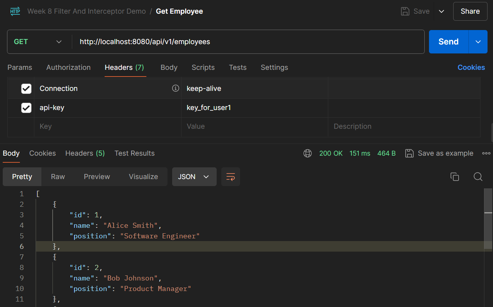
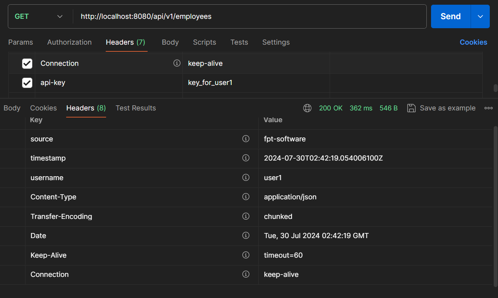
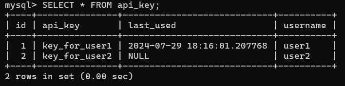
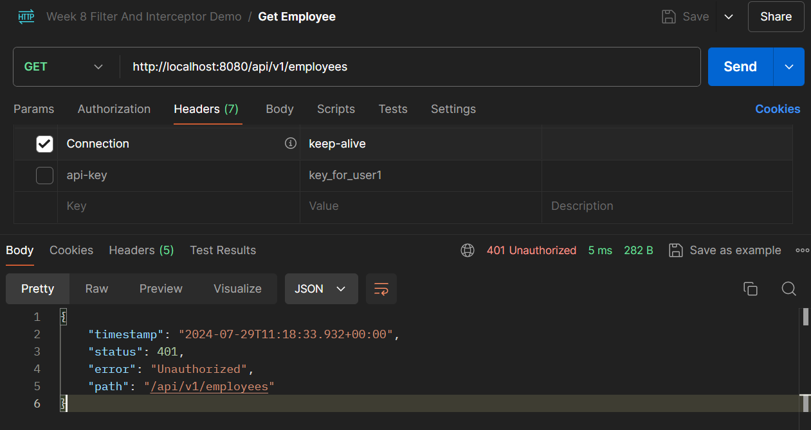
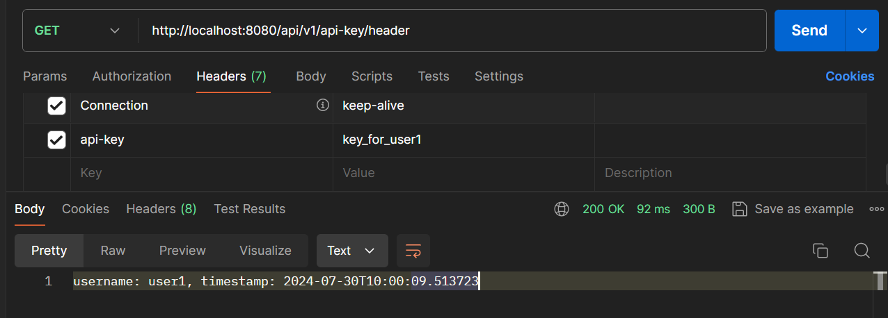

# Assignment 02-03: Filter and Interceptor Demo

## Overview
This repository contains a REST API for managing employee records with integrated API key validation. It is built using the Spring Boot framework with RESTful services and a MySQL database.

## Technologies Used
- **Spring Boot**: Framework for building the application.
- **Spring Data JPA**: For database access and ORM.
- **MySQL**: Database management system used for storing employee and API key data.
- **Spring Web**: For building REST API services.

## Features
- Employee Management: View a list of all employees.
- API Key Management: Store and validate API keys with associated user information.
- Custom Response Headers: Add custom headers (source, timestamp, and username) to all API responses.

## API Key Management
- Store API Keys: API keys are stored in the database with associated user information.
- Validate API Keys: API requests are validated using API keys stored in the database.
- Update API Key Usage: Track the last usage time of API keys.

## Example API Key Records
To test the API key functionality, you can use the following example API keys:
- Key: your_valid_api_key_1,
Username: user1
- Key: your_valid_api_key_2,
Username: user2

Add this to the database before initialization
```sql
-- Insert sample records into the employee table
INSERT INTO employee (name, position) VALUES
('Alice Smith', 'Software Engineer'),
('Bob Johnson', 'Product Manager'),
('Charlie Brown', 'UX Designer'),
('Diana Prince', 'Marketing Specialist'),
('Eve Adams', 'Sales Associate');

-- Insert sample API Key into the api_key table
INSERT INTO api_key (api_key, username, last_used)
VALUES ('key_for_user1', 'user1', NULL),
       ('key_for_user2', 'user2', NULL);
```

## Using Filter for api-key Validation and Add Source Header
The filter is defined in `ApiKeyResponseFilter` to validate api-key and add source to response header
```java
@Component
@AllArgsConstructor
public class ApiKeyResponseFilter implements Filter {
    private final ApiKeyService apiKeyService;

    @Override
    public void doFilter(ServletRequest request, ServletResponse response, FilterChain chain)
            throws IOException, ServletException {
        HttpServletRequest httpRequest = (HttpServletRequest) request;
        HttpServletResponse httpResponse = (HttpServletResponse) response;

        // API key validation
        String apiKey = httpRequest.getHeader("api-key");
        if (apiKey == null || apiKeyService.getApiKey(apiKey).isEmpty()) {
            httpResponse.sendError(HttpServletResponse.SC_UNAUTHORIZED, "Invalid API Key");
            return;
        }

        // Update API key usage
        apiKeyService.getApiKey(apiKey).ifPresent(apiKeyService::updateApiKeyUsage);

        // Add headers to the response after processing
        httpResponse.setHeader("source", "fpt-software");

        // Continue with the filter chain
        chain.doFilter(request, response);
    }
}
```

Filter configuration using `ApiKeyResponseFilter` that already defined before
```java
@Configuration
@AllArgsConstructor
public class FilterConfig {
    private final ApiKeyResponseFilter apiKeyFilter;
    @Bean(name = "apiKeyResponseFilterConfig")
    public FilterRegistrationBean<ApiKeyResponseFilter> apiKeyResponseFilter() {
        FilterRegistrationBean<ApiKeyResponseFilter> registrationBean = new FilterRegistrationBean<>();
        registrationBean.setFilter(apiKeyFilter);
        registrationBean.addUrlPatterns("/*");
        return registrationBean;
    }
}
```

## Using Interceptor to Add Timestamp Header
The interceptor is defined in `ResponseInterceptor` to add timestamp and username to response header 
```java
@Component
@AllArgsConstructor
public class ResponseInterceptor implements HandlerInterceptor {
    private final ApiKeyService apiKeyService;
    @Override
    public boolean preHandle(HttpServletRequest request, HttpServletResponse response, Object handler) throws Exception {
        // Add headers to the response after processing
        response.setHeader("timestamp", Instant.now().toString());

        String apiKey = request.getHeader("api-key");
        if (apiKey != null) {
            apiKeyService.getApiKey(apiKey).ifPresent(apiKeyEntity -> {
                response.setHeader("username", apiKeyEntity.getUsername());
            });
        }

        return HandlerInterceptor.super.preHandle(request, response, handler);
    }
}
```
Interceptor configuration using `ResponseInterceptor` that already defined before
```java
@Configuration
@AllArgsConstructor
public class InterceptorConfig implements WebMvcConfigurer {
    private final ApiKeyService apiKeyService;
    @Override
    public void addInterceptors(InterceptorRegistry registry) {
        registry.addInterceptor(new ResponseInterceptor(apiKeyService));
    }
}
```

## Screenshots
The request should contain api-key

The response header contain source, timestamp and username

Last used is set in database


If there is no api-key in header, the response is unauthorized


Header print in controller
