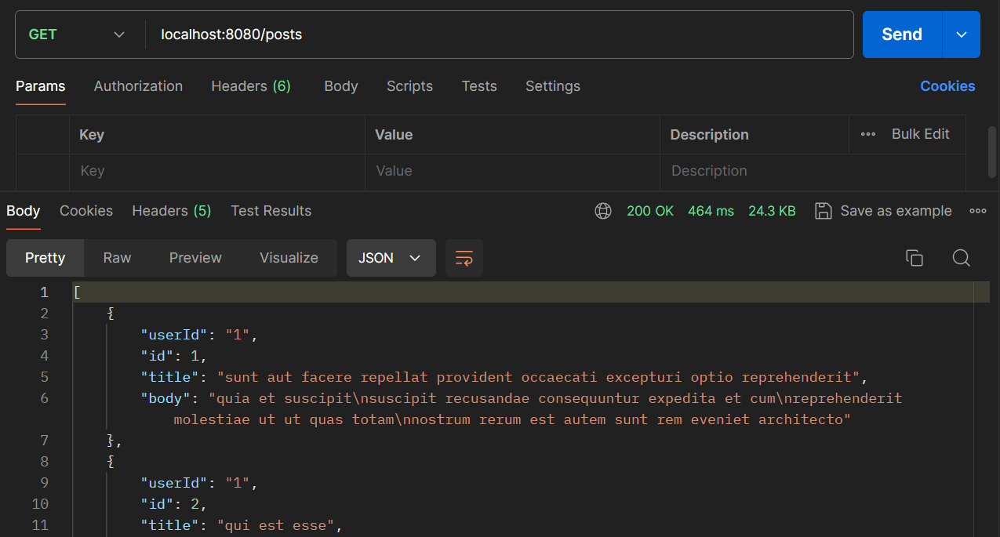
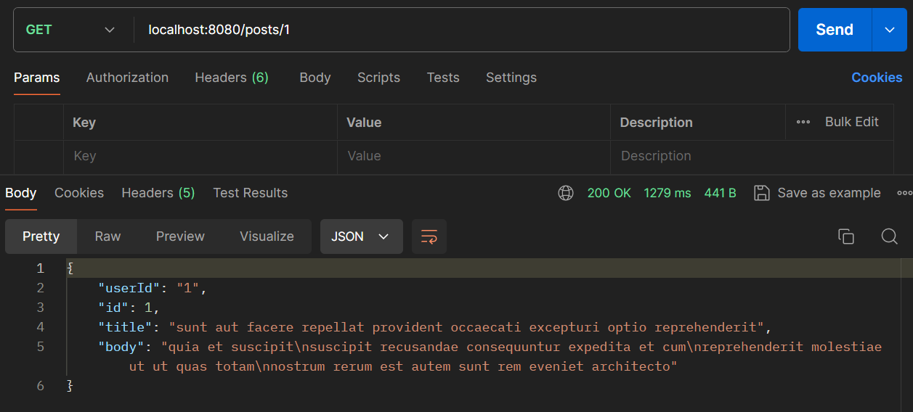

# FeignClient Demo

## Overview
This repository contains a REST API client built using Spring Boot and Feign to interact with the JSONPlaceholder API. The project demonstrates how to use Feign for HTTP requests to external services with configurable timeouts and logging.

FeignClient is a feature provided by Spring Cloud that makes it easier to consume HTTP services. It allows us to write HTTP clients declaratively, meaning we can define an interface in our Java code and annotate it to specify the HTTP methods and endpoints. Feign handles the implementation and the complexities of making HTTP requests and parsing responses.

In this project, the Feign client is configured to interact with the JSONPlaceholder API, a free fake online REST API for testing and prototyping. The JSONPlaceHolderClient interface is defined to provide methods for retrieving posts and individual posts by ID.

## Dependency for FeignClient
1. spring-cloud-starter-openfeign
```xml
<dependency>
    <groupId>org.springframework.cloud</groupId>
    <artifactId>spring-cloud-starter-openfeign</artifactId>
    <version>4.1.3</version>
</dependency>
```
2. spring-cloud-dependencies
```xml
<dependencyManagement>
    <dependencies>
        <dependency>
            <groupId>org.springframework.cloud</groupId>
            <artifactId>spring-cloud-dependencies</artifactId>
            <version>2023.0.3</version>
            <type>pom</type>
            <scope>import</scope>
        </dependency>
    </dependencies>
</dependencyManagement>
```
3. feign-okhttp
```xml
<dependency>
    <groupId>io.github.openfeign</groupId>
    <artifactId>feign-okhttp</artifactId>
    <version>13.3</version>
</dependency>
```
4. feign-httpclient
```xml
<dependency>
    <groupId>io.github.openfeign</groupId>
    <artifactId>feign-httpclient</artifactId>
    <version>13.3</version>
</dependency>
```

## Technologies Used
- **Spring Boot**: Framework for building the application.
- **Spring Web**: For building REST API services.
- **Spring Cloud OpenFeign**: For declarative REST client support.

## Features
- Feign Client Integration: Uses Feign to interact with JSONPlaceholder API.
- Timeout Configuration: Configurable connection and read timeouts.
- Logging Configuration: Basic logging level for HTTP requests and responses.

## Configuration
The Feign client configuration is specified in [application.properties](src%2Fmain%2Fresources%2Fapplication.properties)
```properties
feign.client.config.default.connectTimeout=5000
feign.client.config.default.readTimeout=5000
feign.client.config.default.loggerLevel=basic
```
This configuration sets a connection timeout and read timeout of 5000 milliseconds and enables basic logging for Feign requests.

For client configuration:
```java
public class ClientConfiguration {
    @Bean
    Logger.Level feignLoggerLevel() {
        return Logger.Level.BASIC;
    }

    @Bean
    public ErrorDecoder errorDecoder() {
        return new CustomErrorDecoder();
    }

    @Bean
    public OkHttpClient client() {
        return new OkHttpClient();
    }

    @Bean
    public RequestInterceptor requestInterceptor() {
        return requestTemplate -> {
            requestTemplate.header("user", "username");
            requestTemplate.header("password", "password");
            requestTemplate.header("Accept", ContentType.APPLICATION_JSON.getMimeType());
        };
    }

    @Bean
    public BasicAuthRequestInterceptor basicAuthRequestInterceptor() {
        return new BasicAuthRequestInterceptor("username", "password");
    }
}
```

## API Endpoints
The following endpoints are available for testing the Feign client:

- **GET /api/posts** : Fetches all posts from the JSONPlaceholder API.
- **GET /api/posts/{postId}** : Fetches a specific post by its ID from the JSONPlaceholder API.

## Feign Client
The Feign Client is defined in [`PostClient`](src%2Fmain%2Fjava%2Fcom%2Fweek8%2FFeignClientDemo%2Fclient%2FPostClient.java)
```java
@FeignClient(value = "jplaceholder",
        url = "https://jsonplaceholder.typicode.com/",
        configuration = ClientConfiguration.class,
        fallback = JSONPlaceHolderFallback.class)
public interface PostClient {
    @RequestMapping(method = RequestMethod.GET, value = "/posts")
    List<Post> getPosts();


    @RequestMapping(method = RequestMethod.GET, value = "/posts/{postId}", produces = "application/json")
    Post getPostById(@PathVariable("postId") Integer postId);
}
```
And used in [`PostFeignController`](src%2Fmain%2Fjava%2Fcom%2Fweek8%2FFeignClientDemo%2Fcontroller%2FPostFeignController.java)
```java
@RestController
@AllArgsConstructor
@Import(FeignClientsConfiguration.class)
public class PostFeignController {
    private final PostClient postClient;

    @GetMapping(value = "posts")
    public List<Post> getPosts(){
        return postClient.getPosts();
    }

    @GetMapping(value = "posts/{id}")
    public Post getPostById(@PathVariable(value = "id") Integer id){
        return postClient.getPostById(id);
    }
}
```

## Project Structures
```cmd
└───com
    └───week8
        └───FeignClientDemo
            │   FeignClientDemoApplication.java
            │
            ├───client
            │       PostClient.java
            │
            ├───config
            │       ClientConfiguration.java
            │       CustomErrorDecoder.java
            │
            ├───controller
            │       PostFeignController.java
            │
            ├───exception
            │       BadRequestException.java
            │       NotFoundException.java
            │
            ├───hystrix
            │       JSONPlaceHolderFallback.java
            │
            └───model
                    Post.java
```

## Running the Application
1. Execute `mvn spring-boot:run` in the project directory
2. The application will be accessible at `http://localhost:8080`

## Screenshots


