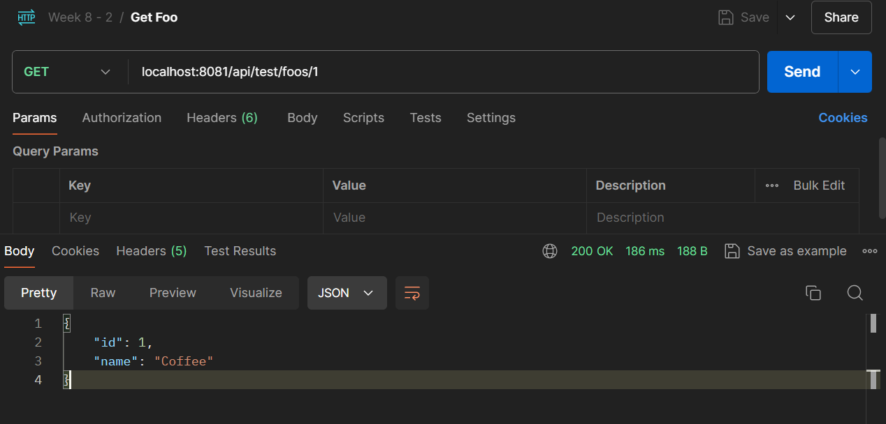
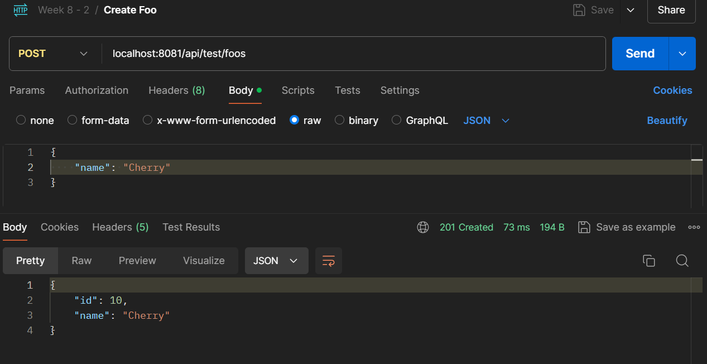
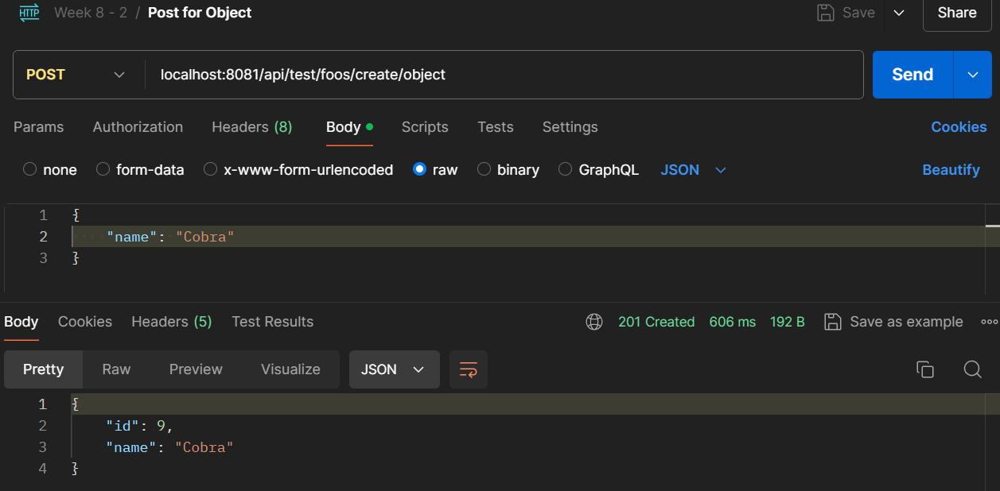
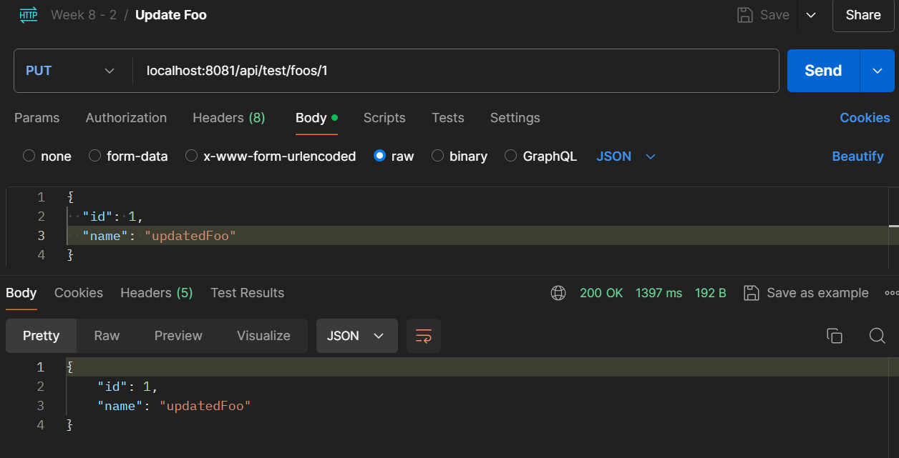
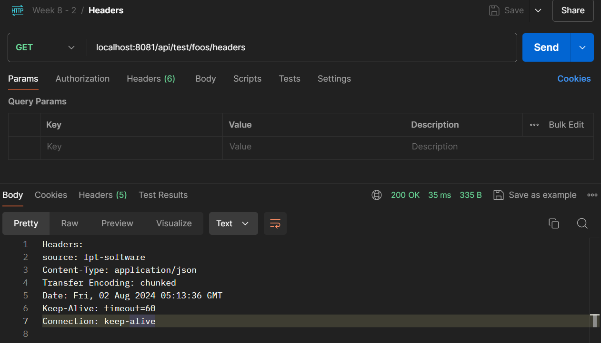
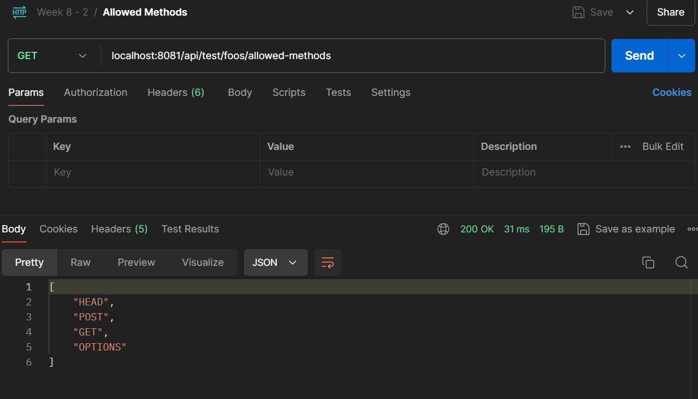
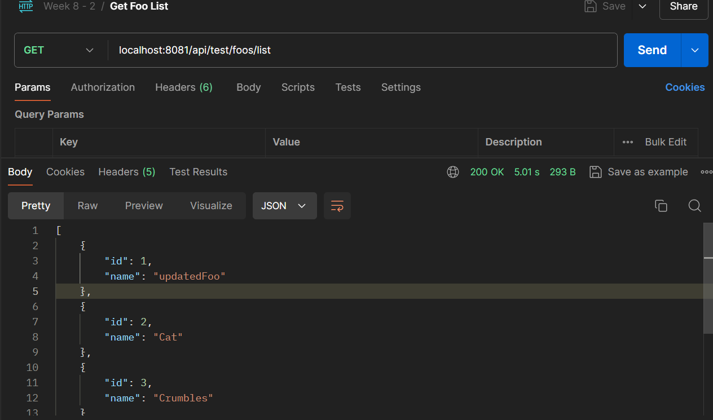
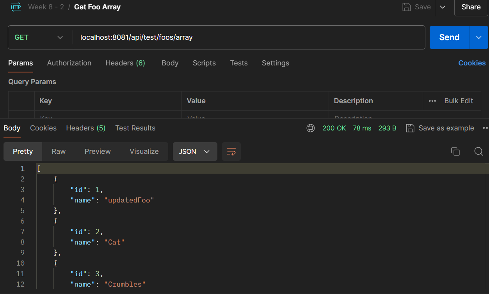
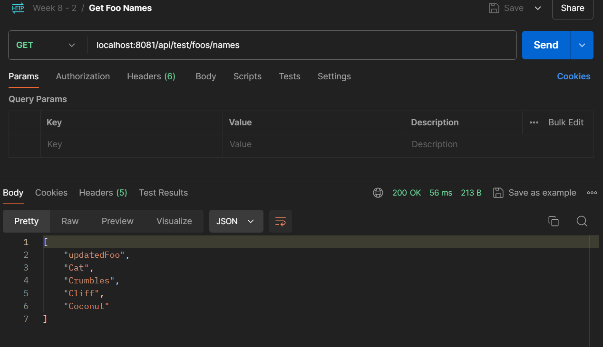

# RestTemplate Demo

## Overview
This project consists of two parts: [FooAPI](FooAPI), a RESTful web service built using Spring Boot for managing Foo entities, and [RestTemplate](RestTemplate), a client application that interacts with the Foo API. The Foo API provides CRUD operations for Foo entities, and FooClient demonstrates various ways to interact with the API, including handling headers and allowed methods.

RestTemplate is a synchronous HTTP client provided by Spring Framework for interacting with RESTful web services. It simplifies the process of making HTTP requests and handling responses by providing a straightforward API for common tasks such as GET, POST, PUT, DELETE, and more.

In this project, RestTemplate is used to perform operations such as retrieving data, creating new resources, updating existing resources, and deleting resources. It is configured to handle different types of HTTP requests and responses, including handling headers and managing timeouts.

The project features a service layer that uses RestTemplate to interact with a specified REST API, demonstrating how to handle various scenarios such as posting data and retrieving information. It also includes methods for accessing response headers and allowed HTTP methods from the API.

## Technologies Used
- **Spring Boot**: Framework for creating and running Spring-based applications.
- **Spring Web**: Provides functionalities to create RESTful web services.
- **MySQL**: Open-source relational database management system.
- **Apache HttpClient**: Library for HTTP client functionalities.
- **Swagger (Springdoc OpenAPI)**: For API documentation.
- **Lombok**: Java library to reduce boilerplate code.

## Features
- REST API Client: Utilizes RestTemplate for making HTTP requests to interact with external REST services.
- Timeout Configuration: Configurable connection, read, and socket timeouts for HTTP requests.
- Header Management: Retrieves and manages HTTP headers and allowed methods from the API.

## Rest Template Service
The Rest Template is used in the [FooService.java](RestTemplate%2Fsrc%2Fmain%2Fjava%2Fcom%2Fweek8%2FRestTemplateDemo%2Fservice%2FFooService.java) for many functions.
```java
@Service
public class FooService {
    private final RestTemplate restTemplate;
    private final String fooResourceUrl;

    public FooService(RestTemplate restTemplate, @Value("${foo.resource.url}") String fooResourceUrl) {
        this.restTemplate = restTemplate;
        this.fooResourceUrl = fooResourceUrl;
    }

    private ClientHttpRequestFactory getClientHttpRequestFactory() {
        int timeout = 5000;
        RequestConfig config = RequestConfig.custom()
                .setConnectTimeout(timeout)
                .setConnectionRequestTimeout(timeout)
                .setSocketTimeout(timeout)
                .build();
        CloseableHttpClient client = HttpClientBuilder
                .create()
                .setDefaultRequestConfig(config)
                .build();
        return new HttpComponentsClientHttpRequestFactory();
    }


    public Foo getFoo(Long id){
        ResponseEntity<Foo> response = restTemplate.getForEntity(fooResourceUrl + "/" + id, Foo.class);
        return response.getBody();
    }

    public Foo createFoo(Foo foo){
        ResponseEntity<Foo> response = restTemplate.postForEntity(fooResourceUrl, foo, Foo.class);
        return response.getBody();
    }

    public URI createFooUsingPostForLocation(Foo foo) {
        HttpEntity<Foo> request = new HttpEntity<>(foo);
        return restTemplate.postForLocation(fooResourceUrl, request);
    }

    public Foo createFooUsingPostForObject(Foo foo) {
        HttpEntity<Foo> request = new HttpEntity<>(foo);
        return restTemplate.postForObject(fooResourceUrl, request, Foo.class);
    }

    public Foo createFooUsingExchange(Foo foo) {
        HttpEntity<Foo> request = new HttpEntity<>(foo);
        ResponseEntity<Foo> response = restTemplate.exchange(fooResourceUrl, HttpMethod.POST, request, Foo.class);
        return response.getBody();
    }

    public Foo updateFoo(Long id, Foo foo) {
        HttpEntity<Foo> requestEntity = new HttpEntity<>(foo);
        ResponseEntity<Foo> response = restTemplate.exchange(fooResourceUrl + "/" + id, HttpMethod.PUT, requestEntity, Foo.class);
        return response.getBody();
    }

    public boolean deleteFoo(Long id) {
        try {
            restTemplate.delete(fooResourceUrl + "/" + id);
            return true;
        } catch (Exception e) {
            return false;
        }
    }

    public HttpHeaders getFooHeaders() {
        return restTemplate.headForHeaders(fooResourceUrl);
    }

    public Set<HttpMethod> getAllowedMethods() {
        return restTemplate.optionsForAllow(fooResourceUrl);
    }

    public List<Foo> getFoosList() {
        ResponseEntity<Foo[]> responseEntity = restTemplate.getForEntity(fooResourceUrl, Foo[].class);
        return Arrays.asList(Objects.requireNonNull(responseEntity.getBody()));
    }

    public Foo[] getFoosArray() {
        ResponseEntity<Foo[]> responseEntity = restTemplate.getForEntity(fooResourceUrl + "/array", Foo[].class);
        return responseEntity.getBody();
    }

    public List<String> getFooNamesFromFooList() {
        ResponseEntity<List<String>> responseEntity = restTemplate.exchange(
                fooResourceUrl + "/names",
                HttpMethod.GET,
                null,
                new ParameterizedTypeReference<List<String>>() {}
        );
        return responseEntity.getBody();
    }
}

```

## Configuration
The RestTemplate configuration is specified in the [application.properties](RestTemplate%2Fsrc%2Fmain%2Fresources%2Fapplication.properties)
```properties
foo.resource.url=http://localhost:8080/api/v1/foos
```
This configuration specifies the base URL for the Foo API endpoints.

The timeout configuration for RestTemplate is managed within the service class using HttpComponentsClientHttpRequestFactory:
```java
private ClientHttpRequestFactory getClientHttpRequestFactory() {
        int timeout = 5000;
        RequestConfig config = RequestConfig.custom()
                .setConnectTimeout(timeout)
                .setConnectionRequestTimeout(timeout)
                .setSocketTimeout(timeout)
                .build();
        CloseableHttpClient client = HttpClientBuilder
                .create()
                .setDefaultRequestConfig(config)
                .build();
        return new HttpComponentsClientHttpRequestFactory();
    }
```

## Project Structures
### RestTemplate
```cmd
├───java
│   └───com
│       └───week8
│           └───RestTemplateDemo
│               │   RestTemplateDemoApplication.java
│               │
│               ├───config
│               │       RestTemplateConfig.java
│               │
│               ├───controller
│               │       FooTestController.java
│               │
│               ├───model
│               │       Foo.java
│               │
│               └───service
│                       FooService.java
│
└───resources
        application.properties
```

### FooAPI
```cmd
├───java
│   └───com
│       └───week8
│           └───FooAPI
│               │   FooApiApplication.java
│               │
│               ├───config
│               │       FilterConfig.java
│               │       HeaderFilter.java
│               │
│               ├───controller
│               │       FooController.java
│               │
│               ├───model
│               │       Foo.java
│               │
│               └───repository
│                       FooRepository.java
│
└───resources
        application.properties
```

## Running the Application
### Foo API
- Navigate to the `FooAPI` project directory.
- Execute `mvn spring-boot:run` to start the Foo API application.
- The application will be accessible at http://localhost:8080/api/v1/foos

### Rest Template
- Navigate to the `RestTemplate` project directory.
- Execute `mvn spring-boot:run` to start the Foo API application.
- The application will be accessible at http://localhost:8081/api/test/foos

## API Endpoints
When the Foo API is running, we can access the API list at http://localhost:8081/swagger-ui/index.html

| Action                           | Method | URL                                                    | Params/Body                                     |
|----------------------------------|--------|--------------------------------------------------------|-------------------------------------------------|
| Get Foo by ID                    | GET    | `http://localhost:8081/api/test/foos/{id}`             | Replace `{id}` with Foo ID                     |
| Create Foo                       | POST   | `http://localhost:8081/api/test/foos`                  | JSON body with Foo data                        |
| Create Foo (POST for Object)     | POST   | `http://localhost:8081/api/test/foos/create/object`    | JSON body with Foo data                        |
| Create Foo (POST for Location)   | POST   | `http://localhost:8081/api/test/foos/create/location`  | JSON body with Foo data                        |
| Create Foo (POST using Exchange) | POST   | `http://localhost:8081/api/test/foos/create/exchange`  | JSON body with Foo data                        |
| Update Foo                       | PUT    | `http://localhost:8081/api/test/foos/{id}`             | Replace `{id}` with Foo ID, JSON body with updated data |
| Delete Foo                       | DELETE | `http://localhost:8081/api/test/foos/{id}`             | Replace `{id}` with Foo ID                     |
| Get Foo Headers                  | GET    | `http://localhost:8081/api/test/foos/headers`          | None                                            |
| Get Allowed Methods              | GET    | `http://localhost:8081/api/test/foos/allowed-methods`  | None                                            |
| Get Foo Names                    | GET    | `http://localhost:8081/api/test/foos/names`            | None                                            |
| Get Foos List                    | GET    | `http://localhost:8081/api/test/foos/list`             | None                                            |
| Get Foos Array                   | GET    | `http://localhost:8081/api/test/foos/array`            | None                                            |

## Screenshots
















