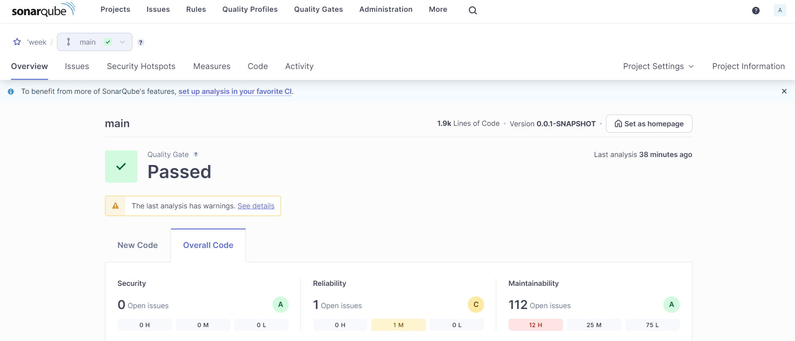

# Unit Testing for MidtermG1 Project

## Overview
This project focuses on unit test
ing for the MidtermG1 application, which is built using Spring Boot. The unit tests ensure the quality and reliability of the code by verifying the functionality of individual components and services.

## Technologies Used
- **Spring Boot**: Framework for creating and running Spring-based applications.
- **JUnit 5**: Framework for writing and running unit tests in Java.
- **Mockito**: Framework for mocking dependencies and verifying interactions.
- **AssertJ**: Library for fluent assertions in tests.
- **Maven**: Build automation tool used for managing dependencies and running tests.

## Prerequisites
- Java 17 or higher
- Maven 3.6.0 or higher

## Properties
The configuration is in [application-test.properties](src%2Ftest%2Fresources%2Fapplication-test.properties), data access layer already using h2
```properties
spring.application.name=Midterm Group 1

spring.datasource.url=jdbc:h2:mem:testdb
spring.datasource.driverClassName=org.h2.Driver
spring.datasource.username=root
spring.datasource.password=password
spring.datasource.initialization-mode=always
spring.datasource.data=classpath:init.sql

spring.jpa.database-platform=org.hibernate.dialect.H2Dialect
spring.jpa.hibernate.ddl-auto=create-drop
spring.h2.console.enabled=true
spring.h2.console.path=/h2-console
```

## Mock, Spy, Mockbean
### `@Mock`
`@Mock` is an annotation provided by the Mockito framework that creates a mock instance of a class. A mock is a dummy object used in unit testing to simulate the behavior of real objects. Mocks are useful for isolating the unit of work and controlling its dependencies.
```java
class ProductServiceImplTest {
    @Mock
    private ProductRepository productRepository;
}
```
In this example, customerRepository is mocked, so its actual implementation is not used.

### `@Spy`
`@Spy` is another annotation from Mockito that creates a partial mock of a class. A spy allows us to call real methods on the object while still being able to stub or verify specific interactions. This is useful when we want to test part of a class’s behavior but still need some of the real functionality.
```java
class ProductServiceImplTest {
    @Spy
    private ProductServiceImpl productService;
}
```
In this example, userService is a spy, meaning some of its methods are mocked, but the real implementation of other methods is used.

## `@MockBean`
`@MockBean` is a Spring Boot test annotation used to create and inject mock instances into the Spring application context. It is part of the Spring Boot Test framework and is typically used for integration tests. `@MockBean` replaces a bean in the Spring context with a mock bean, which helps in isolating the test and avoiding interactions with real dependencies.
```java
@SpringBootTest
public class ProductControllerTests {
    @MockBean
    private ProductService productService;
```
In this example, productService is mocked using `@MockBean`, and it is injected into the Spring application context so that the ProductController can use it.

## JaCoCo
JaCoCo (Java Code Coverage) is a library for measuring and reporting code coverage in Java applications. It helps ensure that unit tests cover a significant portion of the codebase.

Usage:
- Code Coverage Reports: JaCoCo generates reports that show how much of code is covered by tests. This includes line coverage, branch coverage, and more.
- Integration with Build Tools: JaCoCo integrates with build tools like Maven and Gradle to produce coverage reports during the build process.
```xml
<plugin>
    <groupId>org.jacoco</groupId>
    <artifactId>jacoco-maven-plugin</artifactId>
    <version>0.8.9</version>
    <executions>
        <execution>
            <goals>
                <goal>prepare-agent</goal>
            </goals>
        </execution>
        <execution>
            <id>report</id>
            <phase>prepare-package</phase>
            <goals>
                <goal>report</goal>
            </goals>
        </execution>
    </executions>
</plugin>
```


## SonarQube
SonarQube is a static code analysis tool that helps detecting and fixing code quality issues. It provides insights into code smells, bugs, vulnerabilities, and code coverage.

Usage:
- Code Quality Analysis: SonarQube scans codebase for potential issues, such as code smells and bugs, and provides reports on how to improve the quality.
- Integration with Build Tools: It integrates with build tools like Maven and Gradle to run analysis during the build process and generate reports.
```xml
<plugin>
    <groupId>org.sonarsource.scanner.maven</groupId>
    <artifactId>sonar-maven-plugin</artifactId>
    <version>3.4.0.905</version>
</plugin>
```


