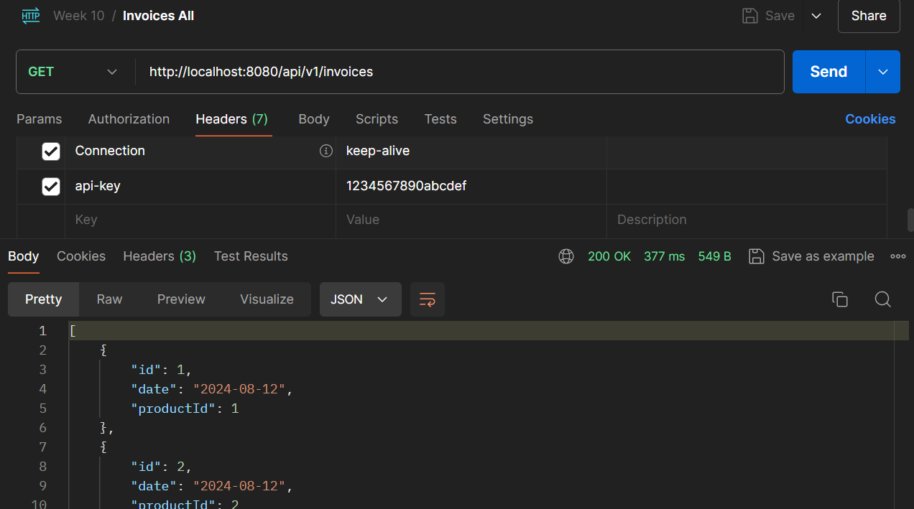
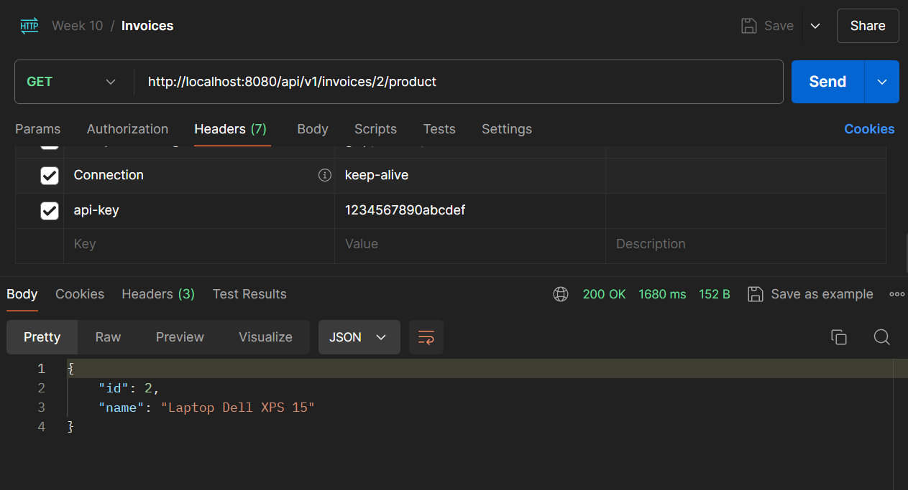
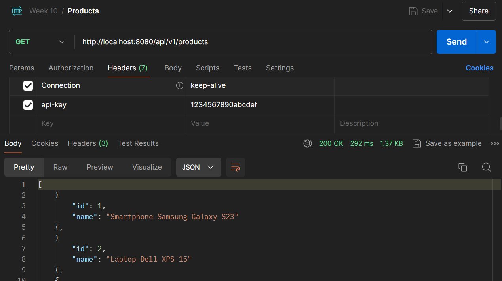
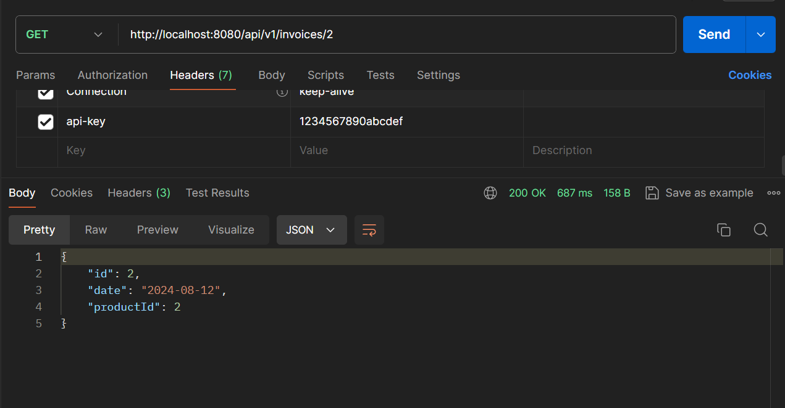
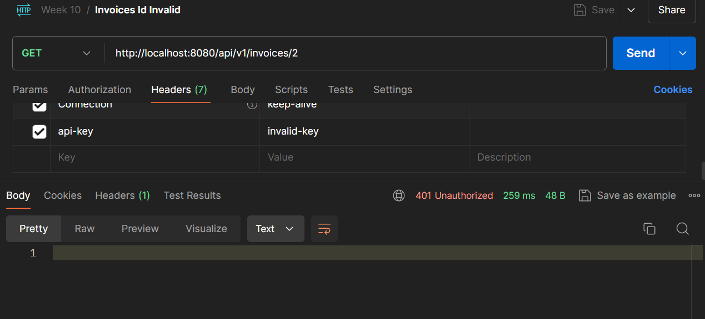

# Invoice, Product, and Gateway Services

## Overview
The Gateway Service is a Spring Cloud Gateway application that acts as a single entry point for accessing multiple microservices. It handles routing requests to various backend services, such as the Invoice API and Product API, based on defined routes and predicates. This setup simplifies client interactions by providing a unified API, allowing clients to access different functionalities through a common URL.

The Gateway Service leverages Spring Cloud Gateway to manage routing, load balancing, and filtering. It uses non-blocking, asynchronous processing to handle high traffic and provide scalability. By configuring routes in the gateway, requests are dynamically forwarded to the appropriate backend service based on the URL path and other criteria.

The ApiKeyFilter is also implemented to ensures requests to your microservices are authenticated by validating API keys. Its main purpose is to verify that incoming requests contain a valid API key before routing them to backend services. The API keys are stored and managed in a MySQL database. This allows for secure and centralized management of keys. The AuthService interacts with this database to validate the API keys.

This project comprises three main components:

1. [Invoice API](invoice_api): A RESTful service for managing invoice-related operations.
2. [Product API](product_api): A RESTful service for managing product-related operations.
3. [Authentication](authentication): A service responsible for validating API keys.
4. [Gateway Service](gateway): A Spring Cloud Gateway service that routes requests to the Invoice and Product APIs.

The Invoice API provides CRUD operations for invoices, while the Product API offers similar functionalities for products. The Authentication service handles the validation of API keys to secure access to the microservices. The Gateway Service serves as a reverse proxy, routing incoming requests to the appropriate microservice based on the request path.

## Interconnection of Projects
1. Invoice API (http://localhost:8081)

   The Invoice API is responsible for managing invoice data. It provides CRUD operations for invoices and a specific endpoint to retrieve products associated with a given invoice. This API interacts with the ProductService to fetch product details related to invoices.

2. Product API (http://localhost:8082)

   The Product API handles CRUD operations for product data. It serves product information that can be consumed by the Invoice API to provide additional details related to invoices. This API is independent and is accessed via its own set of endpoints.

3. Authentication (http://localhost:8083)
   The Authentication service validates API keys to ensure that only authorized requests are processed. It exposes an endpoint for validating API keys, which is integrated with the Gateway Service to authenticate incoming requests. This service checks the validity of API keys stored in a database and provides a response indicating whether the key is valid.

4. Gateway Service (http://localhost:8080)

   The Gateway Service serves as the facade for the Invoice API and Product API. It simplifies the client’s interaction by exposing a unified API that routes requests to the appropriate backend service based on the URL path. The gateway is configured to forward requests to the correct service:

Requests to /invoices are routed to the Invoice API.
Requests to /products are routed to the Product API.
It also forwards requests for products associated with an invoice to the Invoice API.

Additionally, the Gateway Service includes an [ApiKeyFilter](gateway%2Fsrc%2Fmain%2Fjava%2Fcom%2Fweek10%2Fgateway%2Fconfig%2FApiKeyFilter.java) to validate API keys. If a request lacks a valid API key, the gateway responds with a 401 Unauthorized status, ensuring secure access to the microservices.

## Technologies Used
- **Spring Boot**: Framework for building and running Java-based applications.
- **Spring Web**: Provides functionalities to create RESTful web services.
- **Spring Cloud Gateway**: A gateway service for routing and filtering HTTP requests.
- **Spring WebFlux**: Provides the WebClient for making non-blocking HTTP requests.
- **MySQL**: Open-source relational database management system.
- **Lombok**: Java library to reduce boilerplate code.

## Project Structures
### Invoice API
```cmd
├───java
│   └───com
│       └───week10
│           └───invoice_api
│               │   InvoiceApiApplication.java
│               │
│               ├───controller
│               │       InvoiceController.java
│               │
│               ├───exception
│               │       ResourceNotFoundException.java
│               │
│               ├───model
│               │       Invoice.java
│               │       Product.java
│               │
│               ├───repository
│               │       InvoiceRepository.java
│               │
│               └───service
│                       InvoiceService.java
│                       ProductService.java
│
└───resources
    │   application.yml
    │
    ├───static
    └───templates
```

### Product API
```cmd
├───java
│   └───com
│       └───week10
│           └───product_api
│               │   ProductApiApplication.java
│               │
│               ├───controller
│               │       ProductController.java
│               │
│               ├───exception
│               │       ResourceNotFoundException.java
│               │
│               ├───model
│               │       Product.java
│               │
│               ├───repository
│               │       ProductRepository.java
│               │
│               └───service
│                       ProductService.java
│
└───resources
    │   application.yml
    │
    ├───static
    └───templates
```

### Authentication
```cmd
├───java
│   └───com
│       └───week10
│           └───authentication
│               │   AuthenticationApplication.java
│               │
│               ├───controller
│               │       AuthController.java
│               │
│               ├───model
│               │       ApiKey.java
│               │
│               ├───repository
│               │       ApiKeyRepository.java
│               │
│               └───service
│                       ApiKeyService.java
│
└───resources
    │   application.yml
    │
    ├───static
    └───templates
```

### Gateway
```cmd
├───java
│   └───com
│       └───week10
│           └───gateway
│               │   GatewayApplication.java
│               │
│               ├───config
│               │       ApiKeyFilter.java
│               │
│               ├───model
│               │       ApiKey.java
│               │
│               └───service
│                       AuthService.java
│
└───resources
    │   application.yml
    │
    ├───static
    └───templates
```

## API Endpoints

### Invoice API
| Action                            | Method | URL                                    | Params/Body                                    |
|-----------------------------------|--------|----------------------------------------|------------------------------------------------|
| Get All Invoices                  | GET    | `http://localhost:8081/api/v1/invoices` | No parameters; Returns a list of invoices      |
| Get Invoice by ID                 | GET    | `http://localhost:8081/api/v1/invoices/{id}` | Replace `{id}` with invoice ID                |
| Create Invoice                    | POST   | `http://localhost:8081/api/v1/invoices` | Body: JSON representation of `Invoice`         |
| Update Invoice                    | PUT    | `http://localhost:8081/api/v1/invoices/{id}` | Replace `{id}` with invoice ID; Body: JSON of updated `Invoice` |
| Delete Invoice                    | DELETE | `http://localhost:8081/api/v1/invoices/{id}` | Replace `{id}` with invoice ID                |
| Get Products for Invoice          | GET    | `http://localhost:8081/api/v1/invoices/{invoiceId}/product` | Replace `{invoiceId}` with invoice ID |

### Product API
| Action                            | Method | URL                                    | Params/Body                                    |
|-----------------------------------|--------|----------------------------------------|------------------------------------------------|
| Get All Products                  | GET    | `http://localhost:8082/api/v1/products` | No parameters; Returns a list of products      |
| Get Product by ID                 | GET    | `http://localhost:8082/api/v1/products/{id}` | Replace `{id}` with product ID                |
| Create Product                    | POST   | `http://localhost:8082/api/v1/products` | Body: JSON representation of `Product`         |
| Update Product                    | PUT    | `http://localhost:8082/api/v1/products/{id}` | Replace `{id}` with product ID; Body: JSON of updated `Product` |
| Delete Product                    | DELETE | `http://localhost:8082/api/v1/products/{id}` | Replace `{id}` with product ID                |

### Authentication

| Action                             | Method | URL                                             | Params/Body                                      |
|------------------------------------|--------|-------------------------------------------------|--------------------------------------------------|
| Validate API Key                   | GET    | `http://localhost:8083/api/v1/auth/validate-api-key` | Query parameter: `apiKey` (string)               |


### Gateway Service
| Action                            | Method | URL                                    | Params/Body                                    |
|-----------------------------------|--------|----------------------------------------|------------------------------------------------|
| Get All Invoices via Gateway      | GET    | `http://localhost:8080/invoices`        | No parameters; Returns a list of invoices      |
| Get Invoice by ID via Gateway     | GET    | `http://localhost:8080/invoices/{id}`   | Replace `{id}` with invoice ID                |
| Create Invoice via Gateway        | POST   | `http://localhost:8080/invoices`        | Body: JSON representation of `Invoice`         |
| Update Invoice via Gateway        | PUT    | `http://localhost:8080/invoices/{id}`   | Replace `{id}` with invoice ID; Body: JSON of updated `Invoice` |
| Delete Invoice via Gateway        | DELETE | `http://localhost:8080/invoices/{id}`   | Replace `{id}` with invoice ID                |
| Get Products for Invoice via Gateway | GET    | `http://localhost:8080/invoices/{invoiceId}/product` | Replace `{invoiceId}` with invoice ID |
| Get All Products via Gateway      | GET    | `http://localhost:8080/products`        | No parameters; Returns a list of products      |
| Get Product by ID via Gateway     | GET    | `http://localhost:8080/products/{id}`   | Replace `{id}` with product ID                |
| Create Product via Gateway        | POST   | `http://localhost:8080/products`        | Body: JSON representation of `Product`         |
| Update Product via Gateway        | PUT    | `http://localhost:8080/products/{id}`   | Replace `{id}` with product ID; Body: JSON of updated `Product` |
| Delete Product via Gateway        | DELETE | `http://localhost:8080/products/{id}`   | Replace `{id}` with product ID                |

## Screenshots
### Invoice API




### Product API


### Valid API Key


### Invalid API Key
