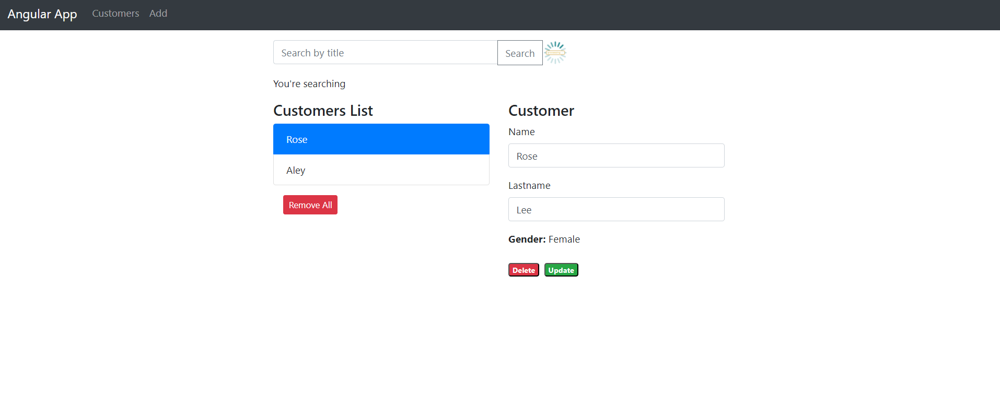
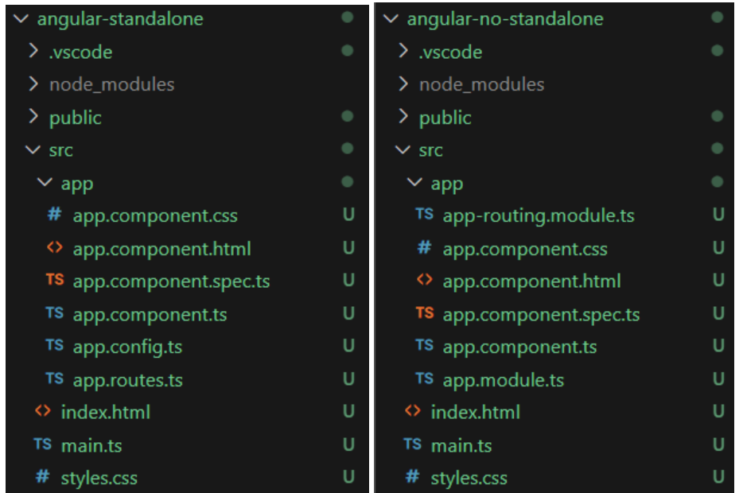

# Week 11: Angular

## [Angular Demo](https://github.com/helenhash/angular-demo)

This is a customer management web using angular front-end and json-server backend. The service is injected via the constructor by `@Injectable` annotation in [CustomerService](https://github.com/helenhash/angular-demo/blob/main/src/app/services/customer.service.ts).

## Angular Component Lifecycle Overview
In Angular, components and directives undergo a series of lifecycle events from their creation to their destruction. These events provide hooks that allow us to execute specific code at key points during the component’s or directive’s lifecycle.

#### ngOnChanges()
- Invoked when any data-bound input property changes. It receives a SimpleChanges object containing current and previous values of the input properties.
- Called before `ngOnInit()` and whenever an input property changes.
- Respond to changes in input properties, such as adjusting internal state or triggering an update process.

Example:
```typescript
ngOnChanges(changes: SimpleChanges) {
  if (changes['inputProperty']) {
    this.updateData(changes['inputProperty'].currentValue);
  }
}
```
In this example, the `ngOnChanges()` method checks if a specific input property, inputProperty, has changed. If so, it calls the `updateData()` method with the new value of inputProperty. This is useful when a component needs to perform an action or update its internal state whenever an input property is modified.

#### ngOnInit()
- Called once, after the first `ngOnChanges()`. It's used for component or directive initialization.
- Called after input properties have been initialized.
- Fetch initial data, set up complex objects, or initiate subscriptions.

Example:
```typescript
ngOnInit() {
  this.dataService.getData().subscribe(data => this.data = data);
}
```
Here, `ngOnInit()` is used to fetch data from a service when the component is initialized. The `dataService.getData()` method returns an observable, and we subscribe to it to populate the data property once the data is received.

#### ngDoCheck()
- Called during every change detection run, allowing for custom change detection logic.
- Called after `ngOnChanges()` on every change detection cycle.
- Implement custom checks beyond Angular's default change detection mechanism.

Example:
```typescript
ngDoCheck() {
  if (this.dataHasChanged()) {
    this.performCustomAction();
  }
}
```
In this example, `ngDoCheck()` allows for a custom change detection logic. The `dataHasChanged()` method is a custom method that checks whether any specific data in the component has changed. If it has, the `performCustomAction()` method is called to handle the change. 

#### ngAfterContentInit()
- Called after Angular projects external content into the component.
- Called once, after the first `ngDoCheck()`.
- Perform operations related to projected content, such as initializing child components that rely on projected content.

Example:
Used to checking if a content is initialized
```typescript
ngAfterContentInit() {
  console.log('Content initialized');
}
```
The `ngAfterContentInit()` method is called once after the content projected into the component is initialized. In this example, a simple console log is used to indicate when this initialization occurs.

#### ngAfterContentChecked()
- Called after every check of projected content.
- Called after `ngAfterContentInit()` and on every subsequent `ngDoCheck()`.
- Respond to changes in the projected content.

Example:
```typescript
ngAfterContentChecked() {
  console.log('Projected content checked');
}
```
This example shows `ngAfterContentChecked()`, which is called every time Angular checks the content projected into the component. It logs a message each time the check occurs.

#### ngAfterViewInit()
- Called after the component’s view (and child views) has been initialized.
- Called once, after the first `ngAfterContentChecked()`.
- Initialize view-dependent logic, such as working with view child components or interacting with the DOM.

Example:
```typescript
ngAfterViewInit() {
  this.childComponent.initialize();
}
```
`ngAfterViewInit()` is called once after the view of the component (including its child components) is initialized. In this example, it calls an `initialize()` method on a childComponent. This hook is useful for performing operations that depend on the view or child components being fully initialized.

#### ngAfterViewChecked()
- Called after every check of the component’s view.
- Called after `ngAfterViewInit()` and on every subsequent `ngAfterContentChecked()`.
- Perform operations that need to occur after the view has been fully checked, like updating UI elements.

Example:
```typescript
ngAfterViewChecked() {
  console.log('View checked');
}
```
`ngAfterViewChecked()` is called every time the view of the component (including its child views) is checked. In this example, it logs a message to indicate when this check occurs. This hook is useful for making updates or triggering actions based on the most recent state of the view, such as adjusting UI elements that depend on the final rendered state.

#### ngOnDestroy()
- Called just before Angular destroys the component or directive.
- Called right before the component is removed from the DOM.
- Clean up resources like unsubscribing from observables, detaching event handlers, or stopping interval timers.

Example:
```typescript
ngOnDestroy() {
  this.subscription.unsubscribe();
}
```
In this example, `ngOnDestroy()` is used to clean up resources before the component is destroyed. Specifically, it unsubscribes from an observable to prevent memory leaks.

## Comparing Standalone and Non-Standalone Components


| **Aspect**         | **Non-Standalone**                                                                 | **Standalone**                                                                                   |
|--------------------|------------------------------------------------------------------------------------|--------------------------------------------------------------------------------------------------|
| **Module Dependencies** | Components are part of an `NgModule`, and dependencies are managed within the module. This can lead to more complex dependency management, especially in large apps. | Components manage their own dependencies directly, leading to potentially simpler and more modular code. |
| **Reusability**        | Requires the component to be declared in a module before it can be reused.      | Can be used in any other component or module by simply importing it, without the need to declare it in a module. |
| **Bootstrapping**      | The application must be bootstrapped through a module.                          | We can bootstrap the application using a standalone component, reducing the need for a traditional `AppModule`. |
| **Lazy Loading**       | Requires defining lazy-loaded modules.                                          | Standalone components can be lazy-loaded directly without the need for a module.                |

Standalone components offer several advantages:
- **Modularity**: Components are self-contained and manage their own dependencies, which promotes modular design.
- **Simplicity**: Reduces the boilerplate code by eliminating the need for NgModules, especially for smaller or simpler applications.
- **Flexibility**: Standalone components can be easily reused and lazy-loaded without additional setup, making them more flexible in complex applications.
- **Scalability**: They make it easier to scale large applications by allowing components to be more independently developed and tested.

## Login Angular Web

### Overview
This project is a simple Angular-based login application demonstrating basic authentication functionality. The application allows users to log in with their credentials and, upon successful login, displays a "Login Success!" message. The project is built using modern Angular features, including standalone components, Angular Material for UI, and a JSON server to simulate a backend.

### Authentication
This project use json-server to simulate backend from [db.json](angular-standalone/db.json). The [model](angular-standalone/src/app/model/user.model.ts) contains model for user login.
```typescript
export interface User {
    username: string;
    password: string;
}
```

[Authentication service](angular-standalone/src/app/service/auth.service.ts) is used to retrieve data from db.
```typescript
login(username: string, password: string): Observable<boolean> {
    return this.http.get<User[]>(baseUrl, {
      params: {
        username: username,
        password: password
      }
    }).pipe(
      map(users => users.length > 0),
      catchError(() => of(false))
    );
  }
```


### Technologies Used
- **Angular**: Frontend framework used to build the web application.
- **Angular** Material: A UI component library for creating responsive and modern designs.
- **RxJS**: Used for handling asynchronous operations and event handling.
- JSON Server: Used as a mock backend to simulate API calls.
- **TypeScript**: The primary language for writing Angular applications.
- **HTML & CSS**: Used for structuring and styling the web pages.

### How to Run
1. Start db.json
```cmd
npx json-server db.json
```

2. Run angular app
```cmd
ng serve
```

### Screenshots


