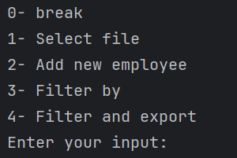

## Employee Management Console Application

### Introduction
This is a simple console application for managing employee data. It allows you to import employee data from CSV and XLSX files, filter the data based on various criteria, and export the data to a CSV file.

### Features
- Import employee data from a CSV file
- Import employee data from an XLSX file
- Filter employees based on ID, name, year of birth, and department
- Export filtered employee data to a CSV file

### File storage
All data is saved and imported from the src/main/java/document.