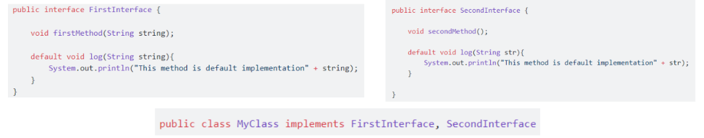
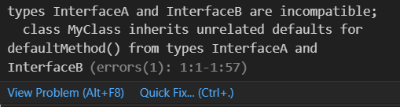

## Assignment 2

#### 1. What happened if 2 interface have same default method?

If a class implements two interfaces that have the same default method, and the class does not override the conflicting method, the code will not compile. Java enforces that the implementing class must resolve the ambiguity by providing an implementation of the conflicting method.



To resolve this conflict, we need to override the conflicting method in the implementing class:

```java
public class MyClass implements InterfaceA, InterfaceB {
    @Override
    public void defaultMethod() {
        InterfaceA.super.defaultMethod();
    }

    public static void main(String[] args) {
        MyClass myClass = new MyClass();
        myClass.defaultMethod(); // InterfaceA's default method
    }
}

```
By overriding the defaultMethod() in MyClass, we can explicitly resolve the conflict. We can choose which interface's default method to call using InterfaceA.super.defaultMethod() or InterfaceB.super.defaultMethod().

#### 2. The difference between abstract class and interface
##### Abstract Class
An abstract class is declared using the abstract keyword. Abstract class can have abstract methods (without implementation) and concrete methods (with implementation). Abstract class also can have constructors. A class can inherit from only one abstract class (single inheritance) and override its abstract method.

```java
public abstract class AbstractClass {
    int var;

    public AbstractClass(int var) {
        this.var = var;
    }

    // Abstract method
    abstract void abstractMethod();

    // Concrete method
    void concreteMethod() {
        System.out.println("This is a concrete method");
    }
}

public class ConcreteClass extends AbstractClass {
    public ConcreteClass(int var) {
        super(var);
    }

    @Override
    void abstractMethod() {
        System.out.println("Implementation of abstract method");
    }
}

```
Abstract class is used to provide some common base functionality along with some methods that must be implemented by classes that inherits it. It is usually a base class for closely related classes that share some common behavior. Abstract class also can have instance variables to store state, which can be shared across methods.

##### Interface
Interface is declared using the interface keyword. It can have abstract methods (implicitly public and abstract) and default or static methods (with implementation). Interface can have constants (implicitly public, static, and final) but can not have a constructor. A class can implement multiple interfaces (multiple inheritance).

```java
public interface MyInterface {
    // Abstract method
    void abstractMethod();

    // Default method
    default void defaultMethod() {
        System.out.println("This is a default method");
    }

    // Static method
    static void staticMethod() {
        System.out.println("This is a static method");
    }
}

public class ImplementingClass implements MyInterface {
    @Override
    public void abstractMethod() {
        System.out.println("Implementation of abstract method");
    }
}
```

Interface is used to defines a contract that implementing classes must follow. Ensures certain methods are implemented by the class. A class can implement multiple interfaces, allowing for a form of multiple inheritance. So it can be used to mix additional functionality into a class through multiple interfaces.