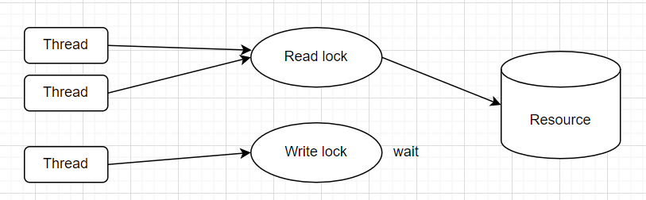
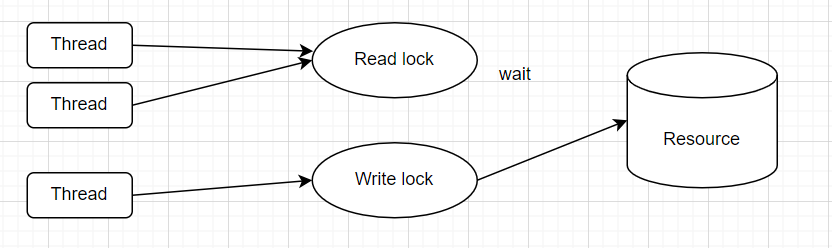

## Assignment 4

#### 1. About deadlock
Deadlock is a situation in which two or more competing actions are each waiting for the other to finish, preventing any from completing. This can be occurs in concurrent or multi-threaded systems where each thread holds a resource and waits for another resource that's currently held by another thread.

###### Example
Two threads, Thread A and Thread B, each needing access to two resources, Resource X and Resource Y.

- Thread A hold Resource X.
- Thread B hold Resource Y.
- Thread A needs Resource Y but it is held by Thread B.
- Thread B needs Resource X but it is held by Thread A.

This condition is called deadlock. Thread A is waiting for Thread B to release Resource Y, and Thread B is waiting for Thread A to release Resource X. Neither thread can proceed.

###### How to prevent
1. Mutual Exclusion
Mutual exclusion means only one process or thread can access a resource at any given time. This is enforced to prevent simultaneous access that could lead to data corruption or inconsistency. Mutual exclusion can contribute to deadlock when a process holds a resource and waits for another resource that is held by another process. However, if we can be able to detect resources behaving in the mutually exclusive manner then the deadlock can be prevented.

2. Hold and Wait
Hold and wait refers to a situation where a process holds a resource already allocated to it while also requesting additional resources that are currently held by other processes. This condition can lead to deadlock if the processes involved do not release resources they are holding until they acquire all the resources they need. Deadlock can be prevented by requiring processes to request all their required resources initially or release held resources before requesting additional ones.

3. No Preemption
No preemption means that resources cannot be forcibly taken away from a process holding them. In the context of deadlock, this means that if a process is holding some resources and requests additional resources that are currently held by another process, it cannot forcibly take those resources from the other process to resolve a potential deadlock situation. Preemption can prevent deadlock by allowing critical resources to be taken away from processes holding them, breaking potential deadlock.

4. Circular Wait
Circular wait occurs when two or more processes form a circular chain where each process holds at least one resource that is requested by the next process in the chain. For example, Process A holds Resource 1 and requests Resource 2 held by Process B, while Process B holds Resource 2 and requests Resource 1 held by Process A. This circular dependency can lead to deadlock if no external intervention occurs to break the cycle.To violate circular wait, we can assign a priority number to each of the resource. A process can't request for a lesser priority resource.

#### 4. Noticeable things when using multiple thread
1. Concurrency: Threads allow different parts of the program to execute concurrently, multiple tasks can run simultaneously.

2. Thread Safety: Ensuring thread safety is crucial when multiple threads access shared resources, potentially lead to data corruption or inconsistent results.

3. Synchronization Overhead: Implementing synchronization mechanisms to coordinate access to shared resources adds overhead if not managed properly.

4. Deadlocks: A deadlock happens when two or more threads are blocked, waiting on a resource held by the other.

5. Context Switching: Threads are managed by the operating system, which performs context switching—switching execution between threads. Context switching has overhead, and can impact performance.

6. Debugging Challenges: Debugging multithreaded applications can be challenging due to non-deterministic behavior caused by thread.

#### 5. ReadWriteLock
The ReadWriteLock interface in Java provides a mechanism for allowing multiple threads to concurrently read from a shared resource, while ensuring exclusive access for writing. This can be useful in scenarios where reads are frequent but writes are less frequent and potentially more disruptive to other operations. So it is either multiple reader or one writer at one time.

Multiple reader thread at one time

One writer thread at one time
